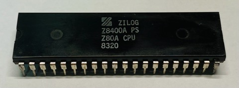
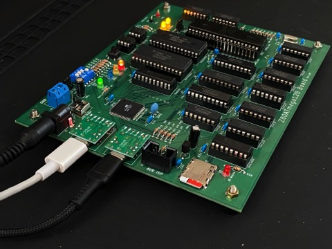

# Z80ATmega128
[English version is here.](./README.md)
## 概要
本プロジェクト目的は、本物のZ80A上でCP/M-80が動くシステムの構築である。  
なぜいまさらそんなモノを？  
きっかけは、部品箱から30年ぶりにZ80A CPUを発見したこと。たぶん1980年あたりに製造されたNMOSプロセスのザイログ純正品だ。このままコレクションしておくのも忍びないので、動かしてみることにした。  

  

だが、この時代に昔と同じようなZ80のワンボードマイコンを再現するなんて面白みがない。そもそもパーツの入手が困難だ。  
そこで以下のアプローチをとることにした。

1. [Z80A](https://www.zilog.com/docs/z80/um0080.pdf)と[ATmega128-16AU](https://www.microchip.com/en-us/product/ATmega128) (AVRマイコン)のハイブリッド構成とする。
2. ROMは使用しない。Z80AとAVRで64KBのSRAMを共有し、Z80のブートストラップコードはAVRが配置する。
3. Z80の外部I/Oと割り込みはAVRのファームウェアでエミュレートする。つまりZ80の周辺I/Oデバイスは全てソフトウェアで記述する。
4. できるだけ入手しやすい部品で回路設計する。(2023年の日本の電子部品市場を想定)

## 実績
* CP/M 2.2がZ80A上でネイティブ動作可能
* micoSDカード上のイメージからCP/Mを自律起動する
* CP/M 3 (CP/M Plus)の動作も確認済み
* 懐かしのテキストアドベンチャーゲーム ZORK I, II, IIが遊べる!
* プリント基板(PCB)も製造してみた
* デモビデオ  
  [](https://youtu.be/2_RJPk65XRE
)

## コンテンツ
```
.
├── avr                      AVR ファームウェア
├── z80                      Z80 ソフトウェア
│   ├── cpm22                CP/M-80 Ver2.2
│   │   ├── bios               BIOS
│   │   ├── sys                CPM.SYS(CCP/BDOS) and cpm.ihx(IPL+CCP/BDOS+BIOS)
│   │   └── image              CP/M 2.2 Disk image
│   └── cpm3                 CP/M 3 (CP/M Plus)
│       └── image              CP/M 3 Disk image
├── doc
│   ├── Hardware/            ハードウェアドキュメント
│   ├── Software/            ソフトウェアドキュメント
│   └── README.md            ドキュメント目次
└── schematics
    └── KiCad
        ├── *.kicad_sch      回路図
        └── *.kicad_pcb      PCB
```
- [ドキュメント一覧](doc/README.md)
  - [Z80ATmega128 Board セットアップガイド](doc/SetupGuide.md)
  - [ハードウェア設計仕様](doc/Hardware/Design.md)
- [開発日記](doc/Diary.md)

## 必要なツール
- [Microchip Studio](https://www.microchip.com/en-us/tools-resources/develop/microchip-studio) for AVR v7.0以降 : avr/以下のAVRファームウェアのコンパイル用
- [AVRISP mkII](https://www.microchip.com/en-us/development-tool/ATAVRISP2) : ATmega128へのファームウェアの焼きこみとFUSEの設定用
- [KiCad](https://www.kicad.org/) v7.0 : 回路図とPCBの設計用
- [ASxxxx Cross Assemblers](https://shop-pdp.net/ashtml/asxxxx.php) : z80/以下のCP/M BIOSのアセンブル用
- [cpmtools](https://github.com/lipro-cpm4l/cpmtools) : CP/M disk imagesの生成用

## 試作基板
  

## プリント基板
    
    

## 回路図


## ライセンス
GPLv3
