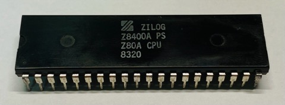
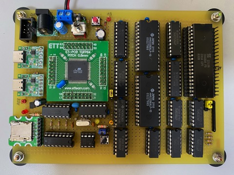
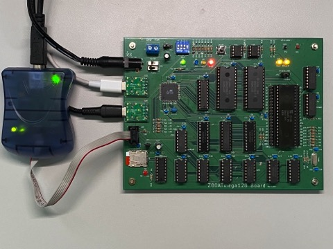
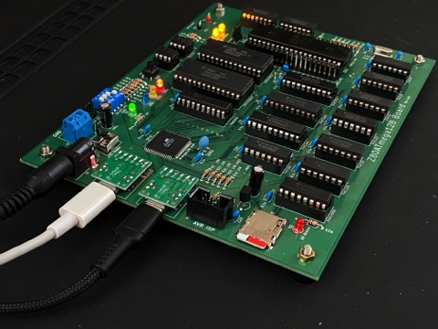
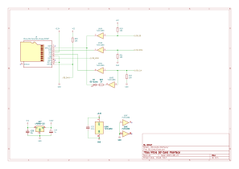
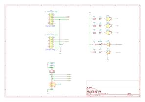

# Z80ATmega128
## Overview
This project aims to build a system utilizing the Z80A and running CP/M-80 directly.

You might be wondering why I chose the Z80 today. Well, it happened to be discovered in my collection of electronic components after being tucked away for 30 years. Moreover, it's an original Zilog Z80A from the NMOS process era, likely manufactured around 1980!  
  

However, rather than simply replicating a single-board microcontroller system from the 1980s, I've decided to take a different approach. Reproducing such a system lacks novelty and excitement, not to mention the difficulty of sourcing the necessary parts. 

Hence, I've devised the following design principles:
1. A hybrid configuration utilizing both [Z80A](https://www.zilog.com/docs/z80/um0080.pdf) and [ATmega128-16AU](https://www.microchip.com/en-us/product/ATmega128) (AVR) microcontrollers.
2. I won't use ROM; instead, a 64KB SRAM will be shared between the Z80A and AVR.
3. The AVR microcontroller will manage the Z80's bootstrap code placement and emulate external I/O.
4. Design circuits using components that are as easy to procure as possible. (As of 2023, mainly in the Japanese electronic parts market.)

### Contents
```
.
├── avr                      AVR firmware
├── z80                      Z80 software
├── doc
│   ├── Diary.md             Development Log (Japanese)
└── schematics
    ├── Design.md            Hardware design document (Japanese)
    └── KiCad
        ├── *.kicad_sch      Schematic
        └── *.kicad_pcb      PCB Data
```
- [Development log](doc/Diary.md)
- [Hardware design document](schematics/Design.md)

### Required tools
- [Microchip Studio](https://www.microchip.com/en-us/tools-resources/develop/microchip-studio) for AVR v7.0 or later is required to build avr/.
- [AVRISP mkII](https://www.microchip.com/en-us/development-tool/ATAVRISP2) is required to program software(avr/) into ATmega128.
- Schematics and PCB is designed by [KiCad](https://www.kicad.org/) v7.0.
- [ASxxxx Cross Assemblers](https://shop-pdp.net/ashtml/asxxxx.php)

### Prototype board
  

### PCB
    
    

### Schematic diagram





## License
GPLv3
