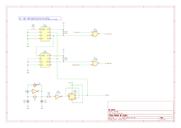
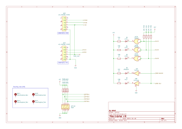

# Z80ATmega128
[日本語版READMEはこちら](./README-ja.md)
## Overview
This project aims to build a Z80A system and run CP/M-80 natively on it.

You might be wondering why I chose the Z80 today. Well, it happened to be discovered in my collection of electronic components after being tucked away for 30 years. Moreover, it's an original Zilog Z80A from the NMOS process era, likely manufactured around 1980!  
  

However, rather than simply replicating a single-board microcontroller system from the 1980s, I've decided to take a different approach. Reproducing such a system lacks novelty and excitement, not to mention the difficulty of sourcing the necessary parts. 

Hence, I've devised the following design principles:
1. A hybrid configuration utilizing both [Z80A](https://www.zilog.com/docs/z80/um0080.pdf) and [ATmega128-16AU](https://www.microchip.com/en-us/product/ATmega128) (AVR) microcontrollers.
2. I won't be using ROM; instead, a 64KB SRAM will be shared between the Z80A and AVR. AVR will manage the placement of the Z80's bootstrap code.
3. AVR firmware will handle the Z80 hardware I/O and interrupt cycles completely. **Any Z80's I/O devices can, in principle, be described by software!**
4. Design circuits using components that are as easy to procure as possible. (As of 2023, mainly in the Japanese electronic parts market.)

## Achievements
* CP/M 2.2 works directly on the Z80 processor.
* The system can boot CP/M from a microSD card containing the CP/M image file.
* CP/M 3 (Non-banked memory version) works as well.
* You can enjoy playing the text adventure game ZORK I, II and III !
* The printed circuit board (PCB) is available.
* Demo Video  
  [](https://youtu.be/2_RJPk65XRE
)

## Contents
```
.
├── avr                      AVR firmware
├── z80                      Z80 software
│   ├── cpm22                CP/M-80 Ver2.2
│   │   ├── bios               BIOS
│   │   ├── sys                CPM.SYS(CCP/BDOS) and cpm.ihx(IPL+CCP/BDOS+BIOS)
│   │   └── image              CP/M 2.2 Disk image
│   └── cpm3                 CP/M 3 (CP/M Plus)
│       └── image              CP/M 3 Disk image
├── doc
│   ├── Hardware/            Hardware documents
│   ├── Software/            Software documents
│   └── README.md            Table of contents
└── schematics
    └── KiCad
        ├── *.kicad_sch      Schematic diagram
        └── *.kicad_pcb      PCB diagram
```
- [Document](doc/README.md)
  - [Z80ATmega128 Board Setup Guide](doc/SetupGuide_en.md)
  - [Hardware design document](doc/Hardware/Design.md)
- [Development log](doc/Diary.md)

## Required tools
- [Microchip Studio](https://www.microchip.com/en-us/tools-resources/develop/microchip-studio) for AVR v7.0 or later is required to build avr/.
- [AVRISP mkII](https://www.microchip.com/en-us/development-tool/ATAVRISP2) is required to program software(avr/) into ATmega128.
- Schematics and PCB are designed by [KiCad](https://www.kicad.org/) v7.0.
- [ASxxxx Cross Assemblers](https://shop-pdp.net/ashtml/asxxxx.php) to build the CP/M BIOS in z80/.
- [cpmtools](https://github.com/lipro-cpm4l/cpmtools) for creating CP/M disk images.

## Prototype
  

## PCB
    
    

## Schematic diagram





## License
GPLv3
