# 開発日記

2022年の年末あたりにパーツ箱からZ80を発掘したことをきっかけに妄想を始める。冗談半分で回路図を描き始めたが、ガチで取り組んでみる気になったので、日記をつけながら進めることにした。

## ポリシー
- 面白そうだと思ったらやる。
- 納得するまでやる。
- 過程を楽しむ。
- ツラくなったら休む。


## 2023/2/25
- 回路は大体固まったので、検証用プロトタイプの仮組み検討を開始。
- KiCadの基板ツールで部品配置を検討しようとしたものの、配線が複雑すぎて気が散るので、実際の基板と部品を眺めながら感覚で配置を決定。
- 基板は手元にあった秋月の[片面ガラス・ユニバーサル基板Ａタイプ2.54mmピッチ(155x114mm)](https://akizukidenshi.com/catalog/g/gP-04708/)を使用。かなり詰め込まないと部品が乗り切らない。  
 
- 回路図にない[USBシリアル変換モジュール](https://akizukidenshi.com/catalog/g/gK-14745/)は、秋月電子のモジュール。この基板の外で信号変換するのが不便なので載せることにした。あとで回路図に反映せねば。でもKiCadの部品を追加定義しないといけないので面倒。誰か作って公開してないかな。

## 2023/2/26
- まずはAVRを動作させないことには話にならないので、以下の配線を行う。
  - ATmega128は64pinのTQFPなので、ピッチ変換基板への取り付け。
  - 電源
  - リセット回路
  - クロック回路
  - ISP接続コネクタ
- ICソケットなどの大物部品も仮配置してみた。固定しておかないと忘れそうなので、落ちない程度にハンダで仮留め。  
  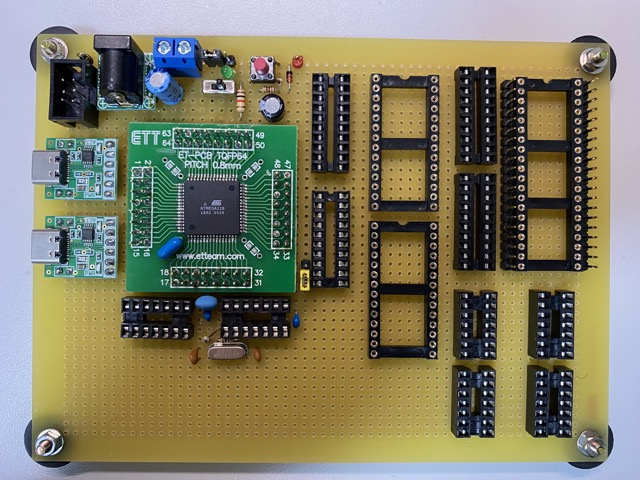
- [実装手順](Progress.md)を書いてみた。

## 2023/2/27
- ISPまわりの配線を行っていると、微妙に74HC125や74HC04のゲートが間に挟まってることに気づく。CMOSなので未使用ゲートの入力放置はNG。ラッチアップ起こして最悪壊れる。なにこれ、もう配線しないとダメなヤツじゃん。
- ということで、AVR/Z80間の制御信号の接続、Z80のクロック回路、WAIT回路あたりの、標準ロジックを使った部分を全部配線した。これでSRAMとバスバッファ、トランシーバー以外のICを載せてデバッグできるようになった。
- ちなみにアドレスバスとデータバスについては迂闊に手を出せない。配線量が膨大なので中断すると絶対に訳がわからなくなる。やり切る時間を確保し覚悟を決めて臨まなければならない。配線面は線材でモリモリになるだろうし、あとで大きな修正が必要になったら悲惨。
- ということで、AVR側の基本動作が確認でき、簡易モニタが動いてデバッグ可能になるまで結線作業は封印しておくことにする。

## 2023/3/4
- 注文していたaitendoの[マイクロSDソケットwith基板 DM3AT-2P](https://www.aitendo.com/product/16641)と3.3Vの3端子レギュレータが届いたので、基板に搭載した。SDカード周りだけは3.3Vなので74HC4050で信号変換している。何の理由で買ったかさっぱり覚えていないのだけど、たまたま手元に持っていた。
- 実際にCP/Mが動くまではSDカードは必要ないので、確認はかなり先になるはずだけど、配線するとモチベーション上がるな。  
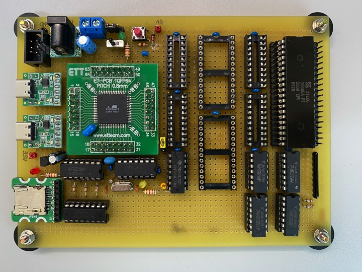

## 2023/3/5
- 今日から実際にATmega128を動かしながら、ハードの動作確認を始める。
- まずはデバッグ用SWを流し込むため、SW開発環境の準備を行う。Windowsに[Microchip Studio](https://www.microchip.com/en-us/tools-resources/develop/microchip-studio)をインストールし、[AVRISP mkII](https://www.microchip.com/en-us/development-tool/ATAVRISP2)の接続の準備をする。適当にATmega128A用のProjectを作り環境を構築。
- Microchip Studio上でAVRISP mkIIが認識できたらプロトタイプ基板のコネクタに接続する。LEDが緑に点灯すれば問題ない。が、赤点滅に。RESET回路の配線が間違っていたので改修した。
- 次にAtmega103互換モードの解除とクロック設定を変更しないといけないのでFuse bitを書き換える。成功すれば、ISPの結線確認とSWの流し込みの準備ができたことになる。
- 書き換え実行でエラーも出ず、電源OFF後も書き込み値が残っているので問題なさそう。

## 2023/3/12
- 最近プライベートで使用するPCはもっぱらM2 Macbook Airになっている。爆速、ファンレスでバッテリー持ちが良く、場所を選ばず使用できる。仕事部屋に篭って作業してると家族の印象が悪いので、こいつで開発できると理想的。
- KiCadはMacOSに対応しているのでOK。問題はMicrochip Studioだ。対応がIntelのWindowsのみ。なんとかならないかと思ってた矢先、Paralles Desktop 18のニュースを思い出した。ARM版Windows11の動作環境としてマイクロソフトが公式に認めたとのこと。
- 早速お試し版をインストールしてみた。Windows自体はストレスなく動く。アクティベートなしにWindows11 Proの使用継続が認められているのも素敵。Microchip Studioもエミューレーションで動作するし、そこそこ早い。だがAVRISPmkIIがどうしても認識しない。それっぽいドライバを探してみるもインストールでエラーが出る。ちょうど確定申告でUSB接続のパソリを使いたかったので試してみたが、これも認識せず。デバイスドライバはネイティブ版が必要らしく、鬼門のようだ。
- ということで、MacでのSW開発は諦めることにした。ビルドは問題ないしシミュレータも動くので条件を選べば使えるのかもしれないが、やはり実機接続できないのは辛い。

## 2023/3/18
- 正式なAVR側のSWを書き始める。Microchip Studioを起動し、AVR 8-bit X8C application projectを作成。
  1. File>New>Projectを選択。
  2. 左のペインで"C/C++"を選択。
  3. 右のペインで"GCC Executable Project"を選択。
  4. Name, Location, Solution nameは適宜設定。
  5. Device Selectionでは"ATmega128A"を選択する。
- 便利そうなのでASF(Atmel Software Fundation)で提供されるモジュールも選択してみた。
  1. ASF>ASF Wizardを選択。
  2. 初回はBoard Selection Wizardが Pop upするので、"User Board template - megaAVR"を選択。
  3. テンプレートに従ってソースファイルが生成される。
  4. Available Modulesからモジュール選択ができるので、以下を選択すると、ソースファイルが追加される。
     - Delay routines (service)
     - Interrupt management (Common API) (service)
     - IOPORT - General purpose I/O service (service)  

- まずはGPIOの初期設定と単純なピン操作の実装から始める。
- Z80のBUSACKの状態をモニタするLEDを利用してみる。GPIOでBUSACKをアクティブにすると、Z80がBUSACKをLowにするのでLEDが消灯するはず。
- ASFのPORTIOライブラリのサンプルを真似して書いてみたが、全然動かんぞ。本当にSWの焼き込みできているのか？

## 2023/3/19
- IOPORTモジュールの機能で、PORT E, PORT F, PORT Gを指定するとコンパイルエラーが出るので、ソースを追ってみた。ASFの実装は、各ポートのPINレジスタを以下の構造体のベースアドレスにセットし、構造体メンバとしてアクセスする。つまりPIN/DDR/PORTのアドレスが連続している前提。
  ```
  /* I/O Ports */
  typedef struct PORT_struct {
	  volatile uint8_t PINCRL;         /* I/O Port PIN DATA READ ONLY */
	  volatile uint8_t DIR;            /* I/O Port Data Direction Set */
	  volatile uint8_t PORTDATA;       /* I/O Port DATA register */
  } PORT_t;
  ```
- 一方、PORT E,F,Gのレジスタマップを見ると、PORT Fは明らかに不連続になっている。PORTE,Gも連続しているものの、PORT A,B,C,Dとはアドレスが離れている。データシートをよく見ると、PORT E,F,Gは拡張I/Oレジスタ領域に存在する。どうもASFでサポートされるのはPORT A,B,C,Dだけのようだ。 
- 釈然としないが、よく使うのはPORTDなので、まぁ良しとするか。

## 2023/3/26
- とりあえずPORT A,B,C,DだけIOPORTモジュールで操作するコードを試しているが、まだ動かない。
- ライブラリのコードを追ってみると、PORTA/B/C/Dのベースアドレスのマクロ定義がおかしいようなのでパッチを当ててみた。

## 2023/3/29
- いろいろハマっているASFのIOPORTモジュール、あきらめて削除した。動きが謎だし、生成されたアセンブリコードも無駄が多かったので。従来のマクロを使った方法でも問題ないので、こっちに切り替える。ソースの可読性や移植性は良いのかもしれないが、明らかにPORT E,F,Gに対応できていないので、一貫性のあるコードは書けないし、一品ものなので移植性はそもそも問題にならない。
- delay()が動くように調整する。クロックの設定のマクロ定義の方法がいまいちわからない。とりあえずオシロでパルス幅を測定したら、まぁまぁ期待通りの時間になっているのは確認できた。usオーダーだと誤差が多いな。
- F_CPUの値が16000000にならないので、後々時間計算で面倒なことになりそうだが、今は目を瞑って先に進むことにする。
- いまのところASFの印象悪い。

## 2023/3/31
- XMEMインターフェースのレジスタ設定をあまりよく読んでいなかったので、ATmega128のデータシートを熟読する。
- 大体理解できたので、レジスタ設定を途中まで書いたが、簡易モニタ動かすのが先だなと思って中断した。先にUARTの設定をやってしまおう。

## 2023/4/1
- USARTの入出力の動作確認を行う。リードライト共にC言語で2行で書けてしまう。8bit、非同期、ノンパリティ、1ストップビット、9600baudの設定で、CH0/1ともに動作テスト完了。瞬殺！
- ATmega128依存の低レベル入出力関数群を作成。割り込みを使用しないポーリング方式なので簡単に書ける。
- プロトタイプ基板には、回路図に記載していない秋月の[USBシリアル変換モジュール](https://akizukidenshi.com/catalog/g/gK-14745/)を2CH分搭載した。USB-CでPCのTera Termと接続して確認。
- UARTで文字が出せるようになったので、C標準ライブラリに似せたコンソール入出力関数群 x_putchar(), x_getchar(), x_puts(), x_gets()を作成。これでデバッグがダントツに楽になる。シンボル衝突を避けるために関数名には'x_'のプリフィックスをつけている。割り込みはまだ手をつけていないので、Bufferd I/Oは未サポート。
- XMODEMでタイムアウト付きの1文字入力が必要になるので、getchar_tout()という独自の関数を作成。割り込みは使わず一定時間ウエイトしながら入力をポーリングする。9600baudだとms単位のウエイトは長すぎるためdelay_us()を使用している。しかしus単位だと積算誤差が非常に大きくなってしまうので、タイムアウト値は実測して調整が必要。
- いずれZ80のコードを流し込むのに必要になるので、XMODEM送受信の関数を作成。本当はもっと後でもいいのでだけど、気が向いたので。コンソール入出力関数と組み合わせてなんとなく動いたことを確認。XMODEMは45年も前の化石みたいなプロトコルだけど、TeratermやPuTTYでもサポートされているし、こういう用途だとまだまだ現役で使えるな。
- 次に簡易モニタプログラムの雛形を作成。コマンド名とそのそのハンドラ(関数ポインタ)のペアのテーブルを用意しておき、以下のメカニズムでコマンド処理するという、至極簡単なもの。
  1. 1行入力を空白文字でトークン分割し、配列にトークンのポインタを格納。
  2. 配列の先頭要素の値でコマンド名をlookupし、マッチしたハンドラを呼び出す。
- バイト書き込み、読み込みコマンドを書き殴って今日は終了。たぶんちゃんとは動かない。
- まともにCのコードを書くのは5年ぶりくらいだけど、だいぶ勘が取り戻せた。10代の頃にマスターした言語は、体に刷り込まれている感じ。

## 2023/4/2
- gets()は簡単にバッファオーバフローして危険なので、get_s() に乗り換えることにした。バックスペース処理や、不要な文字コードを無視する処理も追加。これでモニタの入力部分がそれっぽく動くようになった。昔から疑問なんだけどgets()のバッファ溢れなんてほとんど自明なのに、何でこんな変な仕様にしたんだ？
- ヘキサダンプは比較的綺麗に書けたと思う。バイト書き込み、読み込みのデバッグもして、最低限のモニタプログラム完成。
- ヘキサダンプとバイト読み込みは、パラメータなしでもアドレスオートインクリメントで表示できるようにした。パラメータなしでも次を表示してくれるので地味に便利。
- XMODEMを使ったバイナリ転送もサポートした。
- 自前のコンソール入出力関数群は xconsoleio.[ch] に分離した。
- この2日で作った機能はハードウェアデバッグには必須。毎回書くのは無駄なので、切り出して再利用可能な形にまとめよう。

## 2023/4/3
- 簡易モニタとXMODEMのリファクタリング。
- XMODEMをxmodem.[ch]に分離した。こいつも再利用可能な部品にしよう。
- SRAM接続の確認ができる環境になってきたので、XMEMインターフェースの設定まわりを実装するか。
- ところで内蔵FlashROMと外部SRAMのアドレスってどういう関係なんだっけ？データシート確認しないと。

## 2023/4/4
- 思い出した。AVRはハーバードアーキテクチャなのだった。つまり内蔵FlashROMとRAMはアドレス空間が独立してるってことだ。簡易モニタのメモリアクセスコマンドは、RAM空間しか考慮していなかった。まぁそれでもいいのだけれど、なんか悔しいのでメモリダンプコマンドだけはFlashROMにも対応させた。
- ちなみにROM空間とRAM空間ではアクセスは命令が異なる。ROM空間へのバイトアクセスは効率が悪いため、メモリダンプの1行分16バイトをRAMに転送後、表示するように書き換えた。メモリ転送はmemcpy_P()を使用。FlashROMアクセスのためのマクロや関数を使用するには<avr/io.h>と<avr/pgmspace.h>をインクルードする必要がある。
- [この記事](https://garretlab.web.fc2.com/arduino.cc/docs/learn/programming/memory-guide/)を参考に内蔵SRAMの残量表示のコマンドを追加した。AVRベースのArduino用のコードだがたぶん使えるだろう。
- なんか寄り道してしまったな。。明日こそはXMEMインターフェース対応をやろう。

## 2023/4/5
- 内蔵RAMのメモリダンプを眺めていたら、helpコマンドの文字列リテラルがあるのに気づいた。const指定しているのになぜ？と思ったが、よく考えたらハーバードアーキテクチャなのでFlashROMにはインストラクションしか配置されない。つまりリテラルはたった4KBしかない貴重な内蔵SRAMに配置されてしまうのだ。くっそー、ハーバードアーキテクチャめんどくせーなー。。
- AVRではこんな感じでリテラルを強制的にFlashROMに配置し、使うときだけSRAMにコピーするテクニックがあるようだ。この辺のセコさは組み込みならでは。
    ```
    #include <avr/io.h>
    #include <avr/pgmspace.h>
    const char foo[] PROGMEM = "hogehoge"; 
    a = pgm_read_byte(&foo[i]);
    ```
- やっとXMEMを整理した。こんな感じで外部SRAMの全領域にアクセスできるようになるはず。
  - 0x0000-0x10ffまでの4352bytesはATmega128の内蔵メモリが割り当てられており、外部SRAMの同エリアにはAVR側から直接アクセスできない。この領域にアクセスするためには、以下のように設定する。
    - アドレスバスの上位バイトに割り当てられているPORTCの上位数ビットをIOポートに切り替え、強制的に0をセットすることで外部SRAMのアドレス空間を狭める。
    - 無効化された空間は、外部SRAMの0番地からのシャドウとしてマップされる。内蔵SRAMは 0x0000-0x10ff なので、ここが隠れる 0x2000 以降をシャドウに割り当てる。XMCRBのXMM2/1/0を0/1/1にセットすればよい。
    - これでAVR側からは0x2000-0x30ffにアクセスすることで、外部SRAMの0x0000-0x10ffを間接的に触れるようになった。(データシートによると、この状態で0x3100-0x3fffのアクセスは非推奨なので触らないようにする。)
  - 簡易モニタでは、Z80との共有メモリ前提での操作が多いはず。外部SRAM主体の操作にして、内蔵メモリのアクセスは別コマンドを割り当てた方が使い勝手が良さそうだ。

## 2023/4/7
- 簡易モニタのhelpコマンドの文字列リテラルを配列で定義し、FlashROMに配置させるように変更した。内蔵RAMが320byteも節約できた！
- XMEMの検討結果に基づき外部SRAMのダンプ機能も実装した。メモリ境界をまたぐ際のシャドウの切り替え処理が面倒。プロトタイプ基板の外部RAM周りの結線を行っていないので、ちゃんと動いているのかは不明。
- デバッグの準備も整ったし、いよいよバスライン結線作業の封印を解くか。。。

## 2023/4/8
- バスラインの結線作業を今週末でやり切ることに決心した。
- AVR、Z80, SRAM2個、これらの間にアイソレート用の3ステートバッファやトランシーバが挟まる。結線量を計算してみると、上位アドレス40本、下位アドレス48本、データバス48本。延べ136本。(泣)
- 上位アドレス、下位アドレスの順にアドレスラインを結線を完了。ぶっ通しで6時間かかった。作業順序はこれで正解だったと思う。明日はデータバスに着手予定。
- しかし老眼が進行していて半田付けが辛い。ヘッドルーペ買おうかな。

## 2023/4/9
- データバスの結線作業も完了した。結線のチェックを一通り行い、全ICを装着して電源投入。一応起動することは確認できた。  
  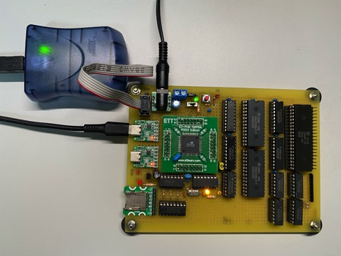
- 回路を一部更新。NMI割り込みでコールされる0x66番地はCP/Mではシステムエリア内だし、/HALTを使うようなプログラムも書くことはないと考えていたが、Z80の動作確認やハードのデバッグに使えそうなので、余っているPORTB6,7に接続することにした。
- 外部SRAMへのバイト読み書きコマンドを簡易モニタに追加し、外部SRAMの動作確認を開始。
- なぜか外部SRAMのダンプがハングアップする。SRAMアクセス時にはZ80からバスアクセス権を取得するために/BUSREQをアクティブにし、/BUSACKがLowになるのをポーリングする。が、これが反応していない。明日以降オシロでZ80側の信号を確認してみるか。GPIOの初期化部を変更したので、バグ仕込んで単に読み取れなくなっているだけかもしれない。
- 0x1100-0xFFFFまでアクセスする場合も、DMAモードに切り替えないといけないことに気づいた。この対応も入れねば。
  
 ## 2023/4/10
 - バスラインの配線してから、AVRISPmk II経由でのファーム書き換えに失敗するようになったのだが、理由がわからん。時々成功するのでタチが悪い。
   - シリアルモニタ用UART CH0のUSB-Cコネクタを外すと成功率が上がる気がする。でもダメな時は徹底してダメ。
   - Microchip Studioの設定(Tools>Device Programming>Interface Settings)で、AVRISP mkIIの通信速度を16.1KHzあたりまで落としても改善されない。
   - AVRISPのSCK(3pin)と、SD Card用のSPIのCLK(11pin)の衝突防止用3ステートバッファの信号の引き回しが長いので直結してみたが、症状変わらず。ロジアナでSCK/MSIO/MSIOをモニタして見るが特に問題はなさそう。
- 他にもZ80の4MHzクロックが生成されたりされなかったりと謎の動きも観測。バスラインの配線以降、全体的に何かがおかしい。

## 2023/4/11
- Z80のクロックの問題、74HC74のクロック分周回路の配線間違いが原因だった。/Sと/RをGNDに接続していたため出力が不定になっていた。/RをVccに接続し直して解決。たまたま条件が揃ったときだけクロック出力されていたのかもしれない。
- /BUSACKも正しく返るようになった。Z80にクロックがきちんと供給されていなかったのが原因だった模様。
- 相変わらずAVRISPmk IIの調子が悪い。故障を疑い、ATmega328の載った別の回路で試してみるとCPU情報がちゃんと取れる。やはりプロトタイプのハード問題か。
- 簡易モニタが立ち上がらない場合があるので、リセットボタンや電源の連続OFF/ONしてみる。シリアル出力が少し出てハングアップしたり、暴走気味に文字が出力し続けたりと不安定。AVR側のプログラムのバグの可能性もあるが、起動後にHW的な外乱が入ってるようにも思える。
- パワーオンリセット、マニュアルリセット、ISPのリセットの信号をちゃんと分離したほうが良いのかも。
- ISPコネクタをプログラムの時のみ接続するようにしたら、エラーが出なくなった(気がする)。挿抜でヘッダケーブルが壊れないか心配だ。
- XMEMインターフェースの動作確認を始める。簡易モニタから外部SRAMへのアクセスコマンドを発行し、ロジアナで、/RD, ALE、アドレスバスの下位8bitを観察した。/BACK=Lowの期間に何かしているようだが、なぜか/RDがアクティブにならない。アドレスもおかしい気がする。

## 2023/4/12
- シリアルに簡易モニターのプロンプトが出たり出なかったり。やはりリセット回路に問題があるのかなぁ。今日は頭を冷やすことにした。

## 2023/4/13
- リセット回路を眺めてたら雑に見えてきたので、以下のように修正することにした。
  - ISP書き込み不具合の原因がISP /RSTの取り回しにあるのではないかと考え、他の信号と分離することにした。具体的にはパワーオン/マニュアルリセット信号とISP /RSTを分離し、ANDをとってからAVRのRESETに入力するように変更。
  - ISP /RSTがZ80のRESETをトリガしないように変更。
  - パワーオン/マニュアルリセット信号を安定させるため、CR積分回路の出力をシュミットトリガで受けるように変更。
- AND1個とシュミットトリガインバータ2個が必要なので、74HC132を使うことにした。手元に在庫がないのでを秋月に発注。動作確認は届いてから。
- 回路図を更新したが1枚に収まらなくなってしまった。リセット回路とSD Cardインターフェースは階層シートで分離した。[こういうビデオ](https://www.youtube.com/watch?v=HxMtFFiYV-E)があるのはとてもありがたい。
- KiCad 7.0がリリースされていたのに気づいた。Apple Siliconにネイティブ対応されてたので早速バージョンアップしたが、速度的な体感差はないような。

## 2023/4/14
- 今日は回路図を眺めただけ。よーわからん。寝た。

## 2023/4/15
- リセット回路、ブレッドボードの試作で波形観察して問題なさそうなので変更した。
- AVISPImk IIの接続すると橙点灯エラーに。/RSTへのプルアップ抵抗の接続忘れが原因だった。10Kを接続して解消。[マニュアル](https://ww1.microchip.com/downloads/en/DeviceDoc/Atmel-42093-AVR-ISP-mkII_UserGuide.pdf)によると、4.7K以下にしてはいけない。
- SCKのプルアップが必要な場合は820Ω以上にしろと書いてある。この信号はSD CardインターフェースのSPIクロックと共用で、10Kでプルダウンされている。一応外しておいた。あとでまた検証せねば。
- 依然としてISPリプログラムが不安定。リセット信号の問題ではないのかなぁ。
- ところでリセット回路のCR積分回路のコンデンサが1uFだと遅延時間が短すぎて、パワーオン時に電源が安定しているか不安なので、47uFに変更した。ちょっと長すぎるかもしれないが500msくらいのLowパルス保証されるようになった。本当は22uFあたりがちょうどよさそうだが、あいにく手元にない。
- 秋月で[DS1232N](https://akizukidenshi.com/catalog/g/gI-15313/)というリセットIC(60円)を購入しておいたのでこちらも試してみた。外付け部品はスイッチと抵抗1本だけ。パワーオン/マニュアルリセット両対応で、安定して700msのパルスが生成される。ただウォッチドックタイマーがOFFできないので、定期的に信号を入れてやらないとリセットが発動してしまう。これは4MHzクロックをぶちこんでおいた。部品点数少ないし、こっちに変更しようかなぁ。
- AVR、Z80にもリセットがかかっているはずなのだが、まだ何か動きがおかしい。特にZ80が不安定。なんか嫌な感じにハマったな。

## 2023/4/16
- 昨晩はZ80のリセット入力が発振しているようだったが、今日測定してみると問題ない。
- ISPは少し安定した気がする。リセットラインを分離した効果はありそう。今までは機嫌が良くなるまで赤点灯が解除されなかったが、Tools>Tools>Device ProgrammingでApplyを押せば緑点灯するようになった。
- それでもDevice Signatureの取得、FlashROMのEraseなどでエラーは出まくる。しかし一度安定すると問題なくリプログラムできるようになる。そのトリガがよくわからない。
- 簡易モニタの動作不安定はまた別。リセット後に起動しなかったり、ハングアップしたり、コマンド入力していないのでリターン有力でメモリダンプが起動したり。機嫌よく動いたと思っても外部メモリにアクセスでハングしたり。インストラクションとデータは内蔵のFlashとSRAMにあるので実行に影響があるとは思えないのだが。

## 2023/4/17
- ダメ元でZ80を止めAVRだけを動作させてみた。ジャンパピンを追加し、/BUSRQをGNDに落とす。すると簡易モニタが安定して起動するようになった。ISPのエラーも嘘のように消えた。Deive signatureの読み込みもリプログラムも問題ない！
- だが釈然としない。/BUSRQがHighのときは、Z80は裏で暴走しまくってるのでバスは滅茶苦茶なのだが、どんな状態であれ影響を受けないよう設計したつもりなので、AVR側が不安定になるはずないのだけれど。。どこかにバグがあるのかなぁ。
- AVRのリプログラムが安定して動くようになったので、以下の簡易モニタのバグを直した。これでやっと外部SRAMのデバッグができるようになった。
  - 単にリターンを入力したときdumpコマンドが実行されてしまう問題。入力がヌルの場合はトークン数が0になるが、exec_command()でこのチェックを行わずにコマンド評価をしていた。
  - 外部SRAMのR/Wコマンドがシャドウエリアをアクセスしない問題。内蔵SRAM境界の計算にマクロINTERNAL_RAM_SIZE(0x1100)ではなく、EXTERNAL_RAM_SIZE(0x10000)を使用していたのが原因。
- (備忘録) 4/15に外したSD CardインターフェースのSCKのプルダウン抵抗、元に戻しても問題ないか確認する。

## 2023/4/19
- SD CardインターフェースのSCKのプルダウン抵抗を無効にしていたが、ISPのリプログラムに影響なさそうだったので元に戻した。
- 外部SRAMのREADを行うと、アドレスの下位8bitがデータとして読めてくる？つまり0x00-0xffの連続値が繰り返し現れる。SRAMの信号を確認すると、XMEMインターフェースの/WR(PG0)と/RD(PG1)が逆に接続されており、リードで/OEがアクティブになっていなかった。改修を最小限にするため回路図の3ステートゲートの入れ替えおよび、PG0とPG1の接続を変更。
- これでREAD値がランダムになった。念の為ロジアナでPA0-PA8をモニタしてみると、まだおかしい。PA1がHighに張り付いているように見える。明日以降、配線をチェックすることにする。

## 2023/4/20
- 寝る前に30分くらいいじってみた。
- PA1がHighに張り付く問題、アホみたいな測定ミスだった。間違えて隣のVcc(52pin)をプローブしていた。(泣)
- バイト単位でWRITE/READすると動いている？インクリメント値,0x55, 0xaa, 0x00, 0xffを書き込み、リードしてチェックサム比較したが正しい？昨日から何も変えていないぞ。でもdumpするとまたインクリメント値しか出てこなくなった。
- 電源OFFで実験していたのが原因か？
- PA3(bit3)がHighにならない。アドレスもデータも。
- ロジアナの観測では、ライトは正しい信号が出ている。
- リードの問題か？

## 2023/4/21
- 使用しているデジタルオシロ(RIGOL DS1104Z Plus)のファームウェアが2022/5/30にリリースされていたので更新した。バージョンが 00.04.04 SP4 から 00.04.05 SP2 になった。手順がどこにもなかったが、downloadしたzipを展開し、DS1000ZUpdate.GELをコピーした、USBメモリをスロットに突っ込んだら認識した。更新終了後、再起動しないとバージョン番号は反映されないようだ。

## 2023/4/22
- 外部SRAMのリードの問題「アドレス下位8bitがデータとして読めてくる。」の解析を始める。
- XMEMインターフェースでは下位アドレスとデータが時分割共有されるので、PA0-7, ALE, /WR, /RDをロジアナでモニタした。
  - ライトは問題なさそう。ALEの立ち下がりでアドレスは正しく出ている。/WRの立ち上がりでのデータも期待値が出ている。
  - リードは問題あり。ALE立ち下がりでのアドレスは正しく出ている。しかし/RDの立ち上がりでのバス波形が下位アドレスのまま関わらない。(つまり簡易モニタでの表示との辻褄は合っている。)
- 74HC574と74HC245のバスラインがPA0-7とハード的に接続されているため、切り分けのため両方とも外して測定するも変化なし。これでSRAMからデータが出力されていないのがほぼ確定。
- SRAMの上位下位を物理的に入れ替えたが変化なし。チップ不良ではなさそう。
- /RD(PG1)とSRAMの/OEの接続は問題なし。
- アドレスA15をSRAMの/CSに接続しているので観測対象の下位32KB側は常にLowになる。測定結果も問題なし。
- /OE(/RD)の立ち下がり時点でアドレスは確定している。よってタイミング的に問題になりそうなのは、/OEの立ち下がりからデータが出力されるまでの時間が十分に確保されているかどうか。使用しているHM62256BLP-7のスペックだと $T_{OE}=40ns$ (max)。/RDパルス幅(/OEの立ち下がりから/RDの立ち上がり)の実測値は70ns程度あるので問題ない。1 WAITで動作させているが、2 WAITにしても変化なし。
- ソフトのシャドウ設定に問題があったので修正。AVRのXMEM関連のレジスタ設定も、何度も見直した。さらにデータシートのサンプルプログラム相当で動かしてみるも、状況変わらず。
- うーむ、、さっぱりわからんなぁ。。。別のSRAMと交換して実験してみるか？

## 2023/4/26
- おかしな現象1
  ```
  >r
  $0000 (2000): 00
  >w 0 $55
  >r 0
  $0000 (2000): 55
  >w 1 $23
  >r
  ```
  1. リセット直後。
  2. 外部SRAMの0番地をリードする。\$0が読めた。
  3. 外部SRAMの0番地に\$55を書き込む。そこをリードする。\$55が読めた！
  4. 外部SRAMの1番地に\$23を書き込む。そこをリードする。ハングアップ。同時に/BUSACK がHighになる。リセットボタンが効かない。
- おかしな現象2
  ```
  >w 0 $55
  >r 1
  $0000 (2000): ca
  >r 0
  $0000 (2000): 55
  >r 1
  ```
  1. リセット直後。
  2. 外部SRAMの0番地に\$55を書き込む。
  3. 外部SRAMの1番地をリードする。\$caが読めた！何の値か知らんけど。
  4. 外部SRAMの0番地をリードする。\$55が読めた！  
     2.で別アドレスを挟んでいるので、0番地のデータ残骸を見ているということはない。またALE=Low後にD8-15が0→\$55に変化しているので、SRAMからデータが出力されたと解釈できる。だが/RDの立ち下がりよりも前にデータが\$55に変化しているのが気になる。SRAMは先に/CS(D6)=Lowになっているので、データは/RD(/OE)=Low以後に出力がされるはずだからだ。
     
  5. 外部SRAMの1番地をリードする。ハングアップ。同時に/BUSACKがHighになる。リセットボタンが効かない。

## 2023/4/29
- HM62256BLP-7をHM62256ALP-10に載せ替えたが変化なし。
- Z80側のデータバス分離用の74HC574, 245だが、Z80もSRAMもTTLレベルなので入力がTTLトレラントな74HCTにしないとまずい。回路図を修正した。
- 手元に在庫がないので、千石電商に発注した。数少ないHCTの品揃えの中に両方ともあったのは幸運なのか、まだ需要があるからなのか。
  
## 2023/4/30
- 外部SRAMのリード問題解決。**原因は/RDの接触不良** だった(泣)。ロジアナでプローブしていた箇所は問題なかったが、その先の接触が不安定だった。早期に/RDまわりの配線を徹底的に見直さなかったのかが悔やまれる。
- 0x12番地へのWRITE/READ動作確認
  ```
  >w $12 $34
  >r $12
  $0012 (2012): 34
  ```
  - ライト   
    
  - リード   
    
- AVRの起動時に、Z80を止めるために以下を実行するようにした。
  - AVRの割り込み禁止。
  - /BUSREQをLowにしてDMAモードにする。
  - 0番地にHALT命令(0x76)をセットし、HALT状態にする。
  - Z80にリセットをかける。
- Z80の/RESETのHigh後、1.5us程度で/HALTがアクティブになるのをロジアナで確認済み。命令のフェッチはできているようだ。
- 動作確認
  - Z80の/HALT信号は、AVRのPORTB(0x36番地)のPB7でモニタできる。
    ```
    >ri $36
    $0036: 61
    ```
    MSBが0なのでHALT状態になっている。
  - 0番地で無限ループするプログラムでHALTが解除されているか確認する。
    ```
    C3 00 00    ; jp 0
    ```
    簡易モニタで0番地から上記を書き込んでリセットする。
    ```
    >w 0 $c3
    >w 1 0
    >w 2 0
    >reset
    >ri $36
    $0036: e1
    ```
    MSBが1なのでHALTは解除されている。
  - ということで、Z80側のプログラムを送り込んで動作確認を開始できるようになった。

## 2023/5/1
- せんごくネット通販から74HCT574と245が届いたので載せ替え。土曜日の深夜に発注して月曜日の午前中に届くなんてえらい。(日曜日定休日だと思ってんだけど。)
- Z80のリセット直後のM1サイクルを観測。/RDの立ち上がり直前のCLKの立ち上がりで0x76(HALT命令)がフェッチできている。Z80のデータバスを直接観測している。  
  
- 0番地での無限ループの実行状態。  
  
- 以上よりメモリリードは問題ない(はず)。
- USB-Cを接続していると、電源が入りっぱなしなので、結線を変更した。回路図も秋月電子の[USBシリアル変換モジュール](https://akizukidenshi.com/catalog/g/gK-14745/)への接続を想定したコネクタに変更。

## 2023/5/2
- パーツ全載せで動かしているので、安定化電源で消費電力を測定してみた。目視で最大294mA。USB-Aでは最大2.5W、5Vなので500mAまで取れるので、USB給電でも問題ない。使用している秋月電子の[USBシリアル変換モジュール](https://akizukidenshi.com/catalog/g/gK-14745/)は350mAでリミットがかかるがまだ少し余裕がある。  
  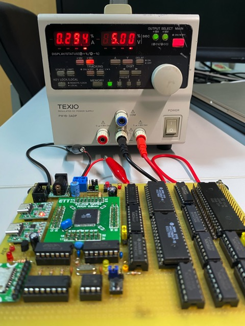
- プロト基板に追加した回路とKiCadの回路図に少し乖離が出てきたので、忘れないように更新した。冗長な部分もあるが、動作確認完了後に最適化することにし、今はデバッグで混乱しないようにする。
  - 秋月電子の[USBシリアル変換モジュール](https://akizukidenshi.com/catalog/g/gK-14745/)のシンボルを作成し回路図に反映。
  - リセットIC(DS1232N)のシンボルを作成し、リセット回路に追加。
  - +3.3V系の電源回路はSD Card Interfaceに移動。
- ハンドアセンブルが面倒なので、Z80のアセンブラ[ASZ80](https://shop-pdp.net/ashtml/asz80.htm)を使用することにした。[ここ](https://shop-pdp.net/ashtml/asxget.php)からDownloadできる。マルチプラットフォーム対応だがとりあえずWindows版でお試し。
- 次は以下のコードでZ80メモリライトを確認する。AVRの簡易モニタから0x1234に0x55が書かれていればOK。
  - 0番地のHALT命令を0(NOP)で上書きし、resetコマンド1番地以降を実行する。resetコマンドごとに信号をモニタする。
    ```
                               1     .AREA   CODE(ABS)
    0000                       2     .ORG    0x0000
                               3
    0000 76            [ 4]    4     HALT
    0001 3E 55         [ 7]    5     LD A, 0x55
    0003 32 34 12      [13]    6     LD (0x1234), A
    0006 76            [ 4]    7     HALT
    ```
  - ロジアナの接続
    ```
    PIN    Z80       SRAM      74HCT245
    D0:    CLK(6)  
    D1:              /OE(22)
    D2:              /WE(27)
    D3:              /CS(20)
    D4:                       AB(1)
    D5:                       CE(19)
    D6:    /BREQ(25)
    D7:    /BACK(23)
           AVR(=SRAMのデータバス)
    D8-15: PA0(51)-PA7(44)
    ```
- reset後に、SRAMの/WEがトリガされずハングアップする。

## 2023/5/3
- 動作が不安定。
  - 0x1234に0x55が書き込まれているのが観測できたこともある。
  - 0x0000に0x76(HALT)が書き込まれず、全メモリが0に見えるときもある。
  - リセットが効かない場合がある。Z80はOK。AVRにリセットがかからないことがあるっぽい。
  - リセット信号自体が出てこないときもある。
  - どこかに接触不良があるかもしれない。AVR側のハンダを舐め直した方がいいかも。
- ASFのDelay routinesを削除した。いい加減delay()のウエイトの不正確さが許容できなくなってきた。また中身のない関数が定義されビルド時のワーニングが出るため。ますますASFの存在意義が見出せない。今後は_delay_xx()マクロを使用する。
  - util/delay.hを使用するためには、F_CPUマクロを定義するかビルドオプションで渡す必要がある。user_board.hで#defineするようにした。
    ```
    #define 16000000UL
    #include <util/delay.h>
    ```

## 2023/5/4
- Z80のメモリライトの問題、SRAMの/WEがアクティブにならないのが原因。/WRと/MREQのOR出力(74HC32 pin3)と、74HC125の入力(pin 2)の接続不良だった。ハンダ不良を改修し、上位下位両方のSRAM空間(0x1234, 0x8034)にZ80からライトして期待値が得られるようになった。  

- なぜか電源OFFでもクロックが出力されているのに気づいた。よく見るとLEDも微かに点灯している。どこかがショートしているということだ。不安定の原因はこれか？
- ATmega128のTQFP-64パッケージのピン、変換基板のピンヘッダのハンダを舐め直したが治らず。

## 2023/5/5
- USB-Cが接続されていると電源が落ち切らない問題。[USBシリアル変換モジュール](https://akizukidenshi.com/catalog/g/gK-14745/)はUSB側から常に給電されるので、本体の電源がOFFでもRXD, TXDには電圧がかかっている。このため接続されている74HC125とAVR側から電流が漏れてしまうようだ。
- 回路の致命的なバグに気づいた。SRAMの/CSをアドレスバスのA15で選択していたが、/CSがLowだとSRAMのデータバスがハイインピーダンスにならないのでZ80のI/Oサイクルと競合してしまう。AVRの外部メモリアクセスとZ80のメモリサイクルの時のみ/CSをアクティブにする必要がある。
  - $/CS = /RD \cdot /WR \cdot /MREQ$とし、SRAMの上位・下位の選択をA15で行うような回路を追加した。ブレッドボードで確認した限りは良さそう。
  - ORゲートが1つ足りないので、I/Oアドレスを制約していたものを利用する。
  - ANDゲートも足りないので74HC08を追加する。  
  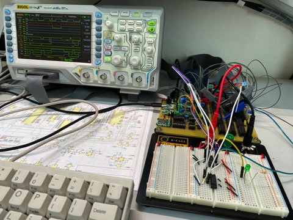

## 2023/5/6
- 昨日のSRAMの/CS設定回路を組み込んだ。基板がてんこ盛りになってしまった。。。  
  
- 相変わらずAVR側が不安定。リセットをかけても簡易モニタが起動しない場合が頻発する。
  - ATmega128にリセット信号は入っている。
  - SWの暴走？ アセンブリレベルのコードが出力されている avr/Debug/avr.lss を調査した。
    - リセットと割り込みベクタテーブルは0番地から配置されている。
    - 0番地のリセットベクタのシンボルは__ctors_end。この中からmain()が呼ばれる。
    - main()→init_board()の先頭でcli()を実行しているので割り込みは禁止はできているはず。
  - 0番地からリセットと割り込みベクタを配置するには以下の設定が必要。が、デフォルトのままなので問題なし。
    - FUSE bit : BOOTRST = 0
    - MCUCR bit 1 : IVSEL = 0
- INT0, INT1, INT4の外部割り込みハンドラを定義し、その中でLED点灯(青、黄、赤)させるようにした。
  - 簡易モニタでメモリダンプ中にハングアップ。そのタイミングで点灯。
    - ダンプできているので冒頭のcli()の実行は確実。にもかかわらず割り込みがかかっているのは何故か？
    - 割り込みがかかる要因は？おそらくZ80が暴走してin/out命令が実行され、それがトリガになっている?
    - リセットかけても、LEDが消灯しない。main()の先頭で消灯しているので、リセット信号は20pinに入っている。しかしソフト的に再起動がかからないように見える。
  - 強制DMAモード(BREQ=Low/)でZ80を止めておくと、100%ではないが問題が改善される。
  - 割り込みハンドラを未定義にするとハングアップの確率は下がるような気がする。
  - 電源ON後にシリアルに出力されず、INT1割り込み(黄点灯)した。リセットが効かない。電源OFF/ONでも変わらず。
  - 以下の実行でLED全点灯。INT0,1,4すべての割り込みがかかるってどういうことだ？特にINT4は、AVR→Z80への外部割り込みの時にしか発生しないはず。
    ```
                                    1     .AREA  CODE(ABS)
    0000                       2     .ORG  0x0000
    0000 3E 12         [ 7]    3     LD A, 0x12
    0002 D3 34         [11]    4     OUT (0x34), A
    0004 76            [ 4]    5     HALT
    ```
    - SRAMの/OE, /CSを観測すると、このコードでアクティブになる。

## 2023/5/8
- なぜかGoogleのサジェストで、Arduino互換機でISPの/RST入力にコンデンサを直列に入れないとスケッチの書き込みに失敗するという[記事](https://burariweb.info/electronic-work/atmega328p-sketch-wrinting.html)が現れた。行動を見張られてるようで気持ち悪い。が、リプログラムに失敗する理由かも。AVRISPmkIIの/RSTの信号だけでは不足で、一定時間内のHighレベルへの信号変化も必要ということらしい。[もう少し詳しい記事](http://kutsushita-neko.cocolog-nifty.com/blog/2013/09/arduino-e10d.html)も。

## 2023/5/13
- どう考えても割り込みハンドラが呼ばれる原因がわからないので、実機ではなくSimulatorで動作させてみた。結果、簡易モニタの入力待ちループで待機のまま。割り込みハンドラが実行されることはなかった。やはりハード的が関係しているのか。
- INT0,1,4のハード的な入力カットして確認してみるか？

## 2023/5/14
- ISPの/RSTに直列にコンデンサを入れる件、結論から言うとNG。AVRISPmkIIの橙点滅になる。元に戻した(涙)。

## 2023/5/28
- しばらく忙しかったのと、動作不安定でモチベだだ下がりだったのだが、気を取り直してデバッグ再開。
- AVRの起動不安定問題、/BREQ=GNDで起動すると症状が消えるので、Z80のリセット後の動作を考え直してみた。起動時に/BREQをLowにしてZ80を止めている隙に、AVRからSRAMにHALT命令を書き込んだつもりになっていたが、タイミング的には全然間に合っていなかった。
- Z80はリセット信号がHighになった後、2,3クロックでM1サイクルに入ってしまう。このとき/BREQがLowでもその命令は実行され、その後に/BACKを返して停止する。初回のM1サイクル前にAVRの動作を保証するためには、Z80のリセット信号をHighにするタイミングを十分に遅らせるしかない。
- 以下、Z80のリセット直後の挙動の観測結果。
  1. /BREQを強制的にGNDにしてリセットした場合。1命令フェッチ、実行後に/BACKを返している。  
     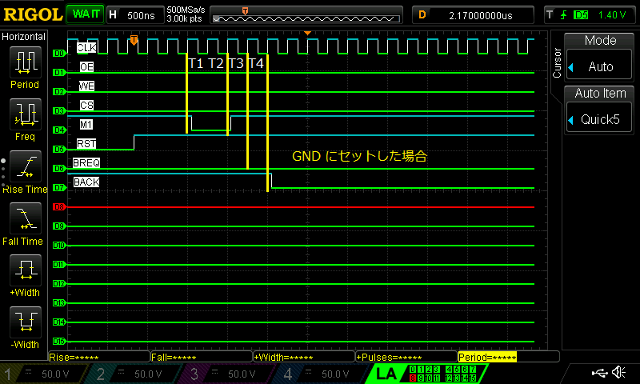
  2. /BREQをAVRのPD6に接続した場合。プルダウンはしているもののAVRの初期状態でバタつくのかLowになるまで時間がかかっている。1命令実行している。(7ステートの命令)  
     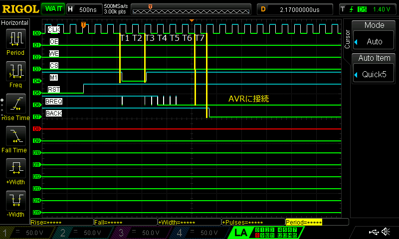
  3. 2.と同様だが、2命令実行してしまっている。(4ステートの命令x2)   
    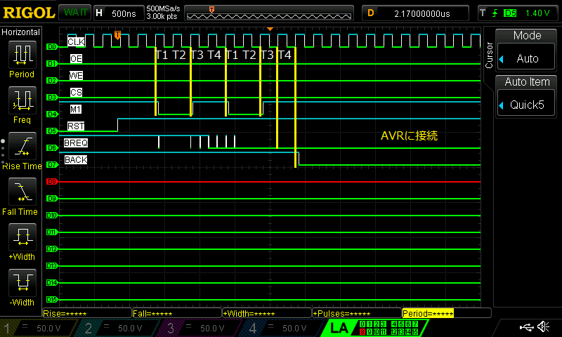

## 2023/6/3
- Z80のリセットをAVRより遅らせるための回路を検討した。リセットパルスを同時にLowにし、HighになるタイミングをZ80がAVRよりも十分後になるようにしたい。色々考えた挙句、[DS1232N](https://akizukidenshi.com/catalog/g/gI-15313/)をカスケード接続することにした。部品点数最小でコストも安く確実に動作するので。一般的な部品でないので秋月が売らなくなったら入手は絶望的かもしれないけど。
- ブレッドボードで実験してみた。
  - 1つ目のDS1232Nの/PBRSTにはManual Resetボタンを接続し、/RST出力をAVRのリセットに使用する。タイムチャートのCH1。
  - 2つ目のDS1232Nの/PBRSTには1つ目の/RST出力を接続し、/RST出力をZ80のリセットに使用する。タイムチャートのCH2。
  - スペック上の/RSTの最小値は250msだが実測では480ms。AVRが0番地に命令を書き込むには十分な時間。
  - **(2023/6/17追記)** Fuse bitのCKSEL0, SUT1,0で、リセットからの付加遅延時間が設定できる。CKSEL0=1, SUT01=00で運用しているため遅延時間は65msである。したがってAVR側のマージンはこの時間を差し引いた値になる。
    - Power ON リセット  
      
    - Manual リセット  
      
- 回路図を見直し、CR積分を使ったリセット回路は削除した。74HC132も不要になった。
- 改修したところ、確実にAVRの簡易モニタが起動するようになった。ISPのリプログラムも安定した。回路変更の効果はありそう。

## 2023/6/4
- ロジアナで全体の信号を確認しつつAVRの初期化コードを見直す。GPIOの初期化でPB5のZ80のリセット信号をLowにしていたのをやめ、DS1232Nのリセット信号に任せるようにしたら、安定して0番地にHALT命令が書き込まれ、Z80がHALTするようになった。起動時の不安定問題はこれで解消された。長かった。。。

- 結局、不安定な原因は以下だった。
  - 結線ミス  
    - クロック回路の74HC74の結線ミスによる発振不良
    - /RDの接触不良
  - リセット問題  
    Z80の実行前に、AVRがブートストラップコードを配置する時間が確保できず、Z80が暴走する。
  - WAIT問題  
    Z80が暴走状態でI/O命令を実行してしまう。/WAITが解除されないのでバスが握りっぱなしになり、AVRからSRAMをアクセスするとバスが衝突する。


- Z80のメモリライトの検証から再開。以下のコードで0x1234に0x55を書き込む。
  ```
  .AREA   CODE(ABS)
  0000                       2     .ORG    0x0000
                             3
  0000 3E 55         [ 7]    4     LD A, 0x55
  0002 32 34 12      [13]    5     LD (0x1234), A
  0005 76            [ 4]    6     HALT
  ```
  簡易モニタの入力。
  問題なし。0xabが0x55に書き変わった。0xaaにしても正しく書き変わったので、全ビット問題なし。
  ```
  >r $1234
  $1234 (1234): ab
  >w 0 $3e
  >w 1 $55
  >w 2 $32
  >w 3 $34
  >w 4 $12
  >w 5 $76
  >reset
  >r $1234
  $1234 (1234): 55
  ```
- これで、Z80からのSRAMリード・ライトの検証完了。明日以降、AVRの割り込みまわりを設定して、Z80のI/Oに対応させる。
  
## 2023/6/5
- 以下のプログラムでZ80のOUT命令の確認を行う。/IOWR(= $/IOREQ \cdot /WR$ )でINT1の外部割り込みが発生するはず。
  ```
                             1     .AREA   CODE(ABS)
  0000                       2     .ORG    0x0000
                             3 
  0000 3E 12         [ 7]    4     LD A, 0x12
  0002 D3 34         [11]    5     OUT (0x34), A
  0004 76            [ 4]    6     HALT
  ```
  簡易モニタの入力。
  ```
  >w 0 $3E
  >w 1 $12
  >w 2 $D3
  >w 3 $34
  >w 4 $76
  >reset
  ```
- /IOWR(= $/IOREQ \cdot /WR$ )=Lowの次のクロックの立ち上がりで/WAITがトリガされている。WAIT生成回路は正しく動作しているようだ。データバスにも0x12が出ているので期待動作になっている。  
  
- まだAVR側のINT1の割り込みハンドラの動作確認ができていない。このためWAITが解除ができず、Z80はデータバスを握ったままWAITしている。この状態ではAVRからのメモリアクセスも正しく動かない。とっとと割り込みハンドラを実装しないことには先に進めない。

## 2023/6/6
- なぜか外部割り込みがかからない。PD0,PD1,PE4へのハード的な接続は問題ない。  
  トリガ条件と割り込みマスクくらいしか設定項目がないのだが。
  ```
  EICRA = 0b10101010;　　　　　　　　　　　　　// Falling edge sense
  EICRB = 0b10101010;　　　　　　　　　　　　　// Falling edge sense
  EIMSK = _BV(INT0)|_BV(INT1)|_BV(INT4);　 // Enable INT0,1 and 4
  ```
  ```
  ISR(INT0_vect) {}
  ISR(INT1_vect) {}
  ISR(INT4_vect) {}
  ```
- 理由がさっぱりわからないのでタイマーによる周期割り込みを実装してみた。
  8bitのTimer0を使用。CTCモードのコンペアマッチで10ms毎に割り込みかける。クロック入力はF_CPU(16MHz)を1024分周している。sei()するだけでハンドラが呼び出された。
  ```
	OCR0  = 10 * F_CPU/1024000UL;           // 1024/16MHz x Count (every 10msec)
	TCCR0 = _BV(WGM01)|                     // CTC mode
	        _BV(CS02)|_BV(CS01)|_BV(CS00);　// start with 1/1024 pre-scaler
	TIFR |= _BV(OCF0);                      // Interrupt every compare match
	TIMSK|= _BV(OCIE0);                     // Enable interrupt
  ```
  ```
  ISR(TIMER0_COMP_vect) {
  }
  ```
  割り込みプログラミングのスタイルは間違っていないようだ。やはり外部割り込みの設定が何か足りないのか。


## 2023/6/7
- 以下のプログラムを実行したら、なぜかINT1割り込みがかかった!　が、理由が不明。
  IN命令だから $/IORD=/IOREQ \cdot /RD$ になるはずで、INT0が発生するのが筋だ。
  ```
                             1     .AREA  CODE(ABS)
  0000                       2     .ORG  0x0000
  0000 DB 34         [11]    3     IN A, (0x34)
  0002 76            [ 4]    4     HALT
  ```

## 2023/6/8
- 信号を取り直してみた。  
  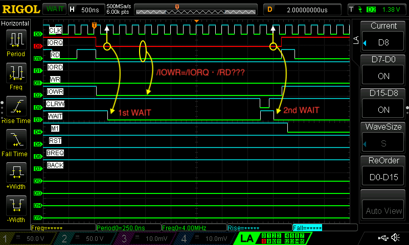
  以下の問題発見。
  1. /IORD, /IOWRが逆転している。
  2. WAIT回路の不具合。1st WAITは想定通り。2nd WAITが想定外。
     - 現在の/WAIT出力と/IOREQのORを取ったものを最終的な/WAITとすればよさそう。/IOREQがHighになるまでヒゲが残るが認識されないので良いだろう。しかし、、もう余分なORゲートがないんだよな。

## 2023/6/9
- /IORD, /IOWRの逆転問題、原因は単純な結線ミス。AVRのINT0(PD0), INT1(PD1)の接続があべこべだった。
- 2nd WAIT問題は、74HC32を1つ追加して対処。リセット回路の見直しで不要になった74HC132の跡地を再利用した。
- 以下のIN/OUTを繰り返すプログラムで動作検証した。
  ```
                             1     .AREA   CODE(ABS)
  0000                       2     .ORG    0x0000
                             3 
  0000                       4 loop:
  0000 DB 34         [11]    5     IN A, (0x34)
  0002 D3 34         [11]    6     OUT (0x34), A
  0004 C3 00 00      [10]    7     JP loop
  ```
  直った！    
    
- だが、AVRの簡易モニターの動作がおかくなってしまった。↑のプログラムを走らせると暴走する？割り込み処理のバグか？3歩進んで2歩下がった感じだなぁ。

## 2023/6/11
- 何も変えずに6/9のプログラムを走らせたら、なぜか/WRがLowに張り付く。だがしばらく動かしていると正常に戻っている。どの状態でも簡易モニタは暴走するので、これが原因というわけではなさそう。  
    
- パワーオンリセットだとHALTが書き込まれるが、マニュアルリセットだと書き込まれない現象がある。


## 2023/6/12
- 昨日の問題はとりあえず横に置いておいて、Z80の外部割り込みの確認。
  ```
                             1     .AREA  CODE(ABS)
  0000                       2     .ORG  0x0000
                             3 
  0000 31 00 02      [10]    4     LD SP, 0x200
  0003 3E 01         [ 7]    5     LD A, 0x01
  0005 ED 47         [ 9]    6     LD I, A
  0007 ED 5E         [ 8]    7     IM 2
  0009 FB            [ 4]    8     EI
  000A 76            [ 4]    9     HALT
                            10 
  000B                      11 int0:
  000B ED 4D         [14]   12     RETI
                            13 
  0100                      14     .ORG 0x0100
  0100 0B 00                15     .DW  int0
  ```
  Z80の/INTのパルス幅は80ns以上あれば良いはずだが、今は1usと長めに取っている。/IOREQと/M1がLowになり、Z80の割り込みサイクルになっている。AVRにはINT4割り込みがかかっており、割り込みベクタの出力、CLRWのLowパルスで/WAIT解除と、I/O READと同様の処理が実行されている。期待通りに動いているようだ。  
    

## 2023/6/14
- 6/9の簡易モニタが暴走する件、Z80のIN命令発行がトリがになっているようだ。OUT命令だけ無限ループさせたときは問題ない。
- 考察
  - IN命令に対するAVRのINT0割り込みハンドラはちょっとタイミングがシビアなので注意が必要。PortAにI/Oデータを出力したら、/CLRWAITを駆動して/WAITを解除する。このタイミングで出力データは74HCT574にラッチされる。これが読み取られるのがT3の立ち下がり。~~読み取りの時にはPortAがハイインピーダンスになっていないとバスが衝突する。~~ しかし、/WAITの立ち上がりからT3の立ち下がりまでは最悪で1クロック=250nsしかない。
  - INT0割り込みハンドラの出口ではこんなことをやる必要があるが、~~(*)部の合計<250nsじゃないとまずいってことだ。~~
    ```
    ISR(INT0_vect) {
      ...
      PORTA = データ出力
      ---ここからがクリティカルセクション---
      PORTD &= ~_BV(PORTD5);  // /CLRWAIT=low
      (*) asm("NOP");         // このあたりで/WAITが立ち上がり、データをラッチ。
      (*) DDRA  = 0x00;       // PortAをHigh-Zに。
      (*) PORTA = 0xff;       // PortAを入力に。
      ---ここまでをT3の立ち下がりまでにやらないといけない。---
      PORTD != _BV(PORTD5);   // /CLRWAIT=High
    }
    ```
    明日以降、このプログラムで実測してみる。
    ```
                               1     .AREA  CODE(ABS)
    0000                       2     .ORG  0x0000
    0000 DB 34         [11]    3     IN A, (0x34)
    0002 76            [ 4]    4     HALT
    ```

## 2023/6/16
- 2023/6/15の考察の間違いに気づいた。
- /WAITの立ち上がりでデータは74HC574にラッチされている。PortAに接続されていない74HCT574の出力側からZ80は値を読むので何の問題もない。
- もちろん、Z80が次にデータバスにアクセスするまでには、PortAはハイインピーダンスになっていなければならない。それはいつか？次のM1サイクル中のT2の立ち上がりでの命令フェッチまでだ。つまりZ80が/WAIT=Highをセンスしてから3.5クロック後。したがって、(*)部の合計 < 250 * 3.5 = 875ns でよい。時間的には十分余裕がある。
- うーん、だとするとAVRが暴走する理由は何だ？
- この単発動作だと問題ない(ように見える)。
  ```
                             1     .AREA  CODE(ABS)
  0000                       2     .ORG  0x0000
  0000 DB 34         [11]    3     IN A, (0x34)
  0002 76            [ 4]    4     HALT
  ```
- 連続動作だと暴走する。
  ```
                             1     .AREA   CODE(ABS)
  0000                       2     .ORG    0x0000
                             3 
  0000                       4 loop:
  0000 DB 34         [11]    5     IN A, (0x34)
  0002 C3 00 00      [10]    6     JP loop
  ```

## 2023/6/17
- 念のため単発動作で観測してみた。 
  1. 74HCT574は/WAITの立ち上がりでが0ｘ55をラッチする。セットアップタイム $t_{SU}=18$ ns(min)、ホールドタイム $t_H=5$ ns(min)ともに問題なさげ。
  2. その直後にAVRはPortAをハイインピーダンスにしている。Z80のM1サイクル前までに余裕で間に合っている。
  3. Z80はT3の立ち下がりで74HCT574のQ1-Q7側から0x55を読み出す。

  タイミング的におかしなところは見当たらない。  
    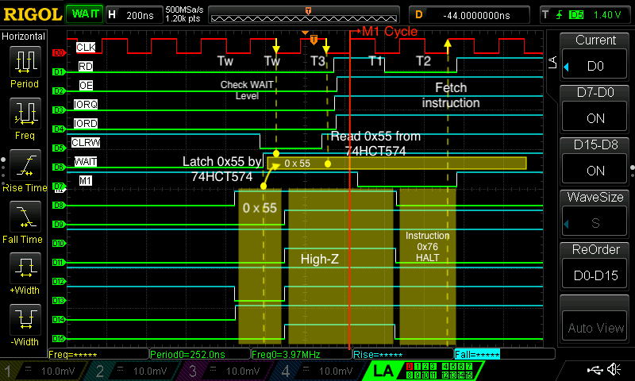

- AVRの暴走の原因、さっぱりわからず目を閉じて途方に暮れていた。するとなぜか突然Fuse bitが気になり出した。現在の設定は以下。
  - EXTEND: 0xFF
  - HIGH: 0xD1
  - LOW: 0xCF
- よくみるとHIGH byteのCKOPTが0になっている。これはAVRのクロック設定で、16MHzセラロック接続の場合は1にしないといけないはず。
- 試しに1に変更すると暴走しなくなった? 0に戻すと暴走する。確かに有意差がある。これが原因か！  
  連続動作でも問題が出なくなった。直ったようだ。  
  
- しかし、こういうひらめきはどこから来るのだろう。なぜFuseに思い至った理由が自分でもさっぱりわからない。試行錯誤の果てに斜め上から解決方法が降ってきた経験は初めてではないが、これは単に自分の洞察力が足りないだけなのか、あるいは悩み抜く過程で脳内に湧き起こるモノなのか。

- **Z80→AVRの疎通実験**
  - Z80はOUT命令でポート番号1に'Hello'を送信する。AVRはINT1の割り込みハンドラでそれを受け取り、UART1に出力する。  
  - Z80のプログラム
    ```
                                1     .AREA   CODE(ABS)
     0000                       2     .ORG    0x0000
                                3 
     0000 06 05         [ 7]    4     LD B, 5
     0002 0E 01         [ 7]    5     LD C, 1
     0004 21 0A 00      [10]    6     LD HL, str
     0007 ED B3         [21]    7     OTIR
     0009 76            [ 4]    8     HALT
                                9 
     000A                      10 str:
     000A 48                   11     .DB "H"
     000B 65                   12     .DB "e"
     000C 6C                   13     .DB "l"
     000D 6C                   14     .DB "l"
     000E 6F                   15     .DB "o"
    ```
    以下を簡易モニタから入力。
    ```
    w 0 $06
    w 1 $05
    w 2 $0E
    w 3 $01
    w 4 $21
    w 5 $0A
    w 6 $00
    w 7 $ED
    w 8 $B3
    w 9 $76
    w $a $48
    w $b $65
    w $c $6C
    w $d $6C
    w $e $6F 
    reset
    ```
  - **動いた！**
    ```
    Hello
    ```
- **これでAVRでZ80のI/Oをエミュレーションできる環境が整った！**
- 直近のTODOは以下。
  1. クロスアセンブルしたZ80のコードを送れるように、INTEL HEX/バイナリ変換プログラムを作る。
  2. 任意のポートのIN/OUT命令に対応したハンドラを扱える枠組みを作る。
  3. これを使って、USART1のコンソールI/Oを作る。
  4. まずはエコーバックできるようにする。
    - [AVR] RX1から1文字入力
    - [AVR] Z80に割り込みで通知(まずはNMI)
    - [Z80] IN命令で入力文字を受信
      - [AVR] INT1ハンドラで文字を送信
    - [Z80] OUT命令で文字を送信
    - [AVR] INT0ハンドラで文字を受信
    - [AVR] TX1に文字出力
  5. コンソールのBuffered I/O化。割り込みハンドラでBlocking I/Oを使うのはレイテンシがデカすぎて辛いので。

## 2023/6/18
- INTEL HEX/バイナリ変換を簡易モニタに組み込んだ。コンソールからXMODEMでINTEL HEXファイルを転送すると、外部SRAMの所定のアドレスにプログラムが展開される。これで簡易モニタの1バイト書き込みコマンド(w)で、ちまちまとコードを入力する必要がなくなった。
- INTEL HEXのフォーマットはシンプルなので、メモリに展開された前提ならパーサーは楽勝で書ける。しかしAVRの内蔵SRAMはわずか4KBなので、その前提は置けない。ファイルはXMODEMで受信するので128byte毎にバッファリングするが、それでも繋ぎ目の処理は面倒。そこでパーサーはステートマシン形式にして、文字列ストリームを1文字ずつ突っ込むとバイナリ変換＆メモリへの書き込みを行う設計とした。
- 既に実装済みのXMODE受信と外部SRAMアクセスのコードと組み合わせ、やや無謀とは思いつつも、昨日の疎通実験のプログラムのHEXファイルをTeraTermからXMODEMで流し込んだところ、なんと一発で動いた！昨日から調子いいなー。
- これでZ80側のプログラムをバリバリ書けるようになった。
#### ステートマシン
- 64KBのアドレス空間をサポートできれば十分なので、レコードタイプは00と01のみサポート。
- 参考: [INTEL HEX](https://ja.wikipedia.org/wiki/Intel_HEX)


## 2023/6/19
- 本腰を入れてZ80のソフト開発を行うためのクロスアセンブル環境を構築した。
- Windows/Macで同じ使い勝手にしたいので、VSCode + Docker + Dev Containerにすることにした。([この記事](https://zenn.dev/harurow/articles/c903de5f479a57)を参考にした。)
- アセンブラは[ASxxxx Cross Assemblers](https://shop-pdp.net/ashtml/asxxxx.php)のasz80を使用する。wgetで[ソースコードのzip](https://shop-pdp.net/_ftp/asxxxx/asxs5p40.zip)をdownloadし、必要なコマンドだけコンパイルして取り出すMakefileを書いた。Dev Containerを使いたくない場合も考え、Dockerfileでは行わないことにした。
#### Dev Containerの使い方
VS CodeにDev Containersプラグインをあらかじめインストールしておく。
1. Z80ATmega/の直下でVSCodeを起動する。
2. "コンテナで再度開く"というダイアログが出るので選択。  
   (初回はコンテナ構築が行われ、以後はそのコンテナが再利用される。)
3. 起動に成功すると、/z80以下がホストにマウントされる。
4. VSCodeでbashを開くと、そこでアセンブルできるようになる。

## 2023/6/20
- GitHubに間違ったアカウントで何度かコミットしてしまったことに気づいたので、禁じ手ではあるがコミット履歴を強制的に書き換えた。
  - 再発防止策？
    - 間違ったアカウントをブロックしてみた。これでコミットが抑止できるのかは試していない。
- Z80の開発環境まわりのリファクタリング
  - コンテナのベースイメージを`debian:11-slim`に変更した。
  - クロスアセンブラの生成方法や、test用のZ80コードのMakefileを修正。

#### コミット履歴の強制変更手順
1. 最終的に強制pushされるので、 ローカルに変更が残っていない状態にしておく。
2. 以下をコマンドラインから入力。  
    ```
    git filter-branch --env-filter '
    if [ $GIT_AUTHOR_NAME = "変更したいアカウント名" ]
    then
        export GIT_AUTHOR_NAME="46nori"
        export GIT_AUTHOR_EMAIL="46nori@users.noreply.github.com"
        export GIT_COMMITTER_NAME="46nori"
        export GIT_COMMITTER_EMAIL="46nori@users.noreply.github.com"
    fi'
    ```
3. 以下のようなメッセージが出る。  
    ```
    WARNING: git-filter-branch has a glut of gotchas generating mangled history
      rewrites.  Hit Ctrl-C before proceeding to abort, then use an
      alternative filtering tool such as 'git filter-repo'
      (https://github.com/newren/git-filter-repo/) instead.  See the
      filter-branch manual page for more details; to squelch this warning,
      set FILTER_BRANCH_SQUELCH_WARNING=1.
    Proceeding with filter-branch...

    Rewrite 8f56cebc1c0230d5fbfc522531d0d64bbfbcd58a (1/73) (0 seconds passed, remaining 0 predicted)
    Rewrite d482d49add8ea6341497e7d7f006c71f0f99090b (2/73) (0 seconds passed, remaining 0 predicted)
    ...
    ...
    Rewrite 0be7c1b74f456dfd4dca7f6c257fb7cb10d0d623 (59/73) (2 seconds passed, remaining 0 predicted)    
    Ref 'refs/heads/main' was rewritten
    ```
4. コミットログを確認。変更したいアカウント名が消えていればOK。  
    ```
    git log --pretty=full
    ```
5. リモートに反映させる。GitHub DesktopならRepositoryメニューに`Force Push`が現れるのでこれを選択。(普段は`Push`)
   ```
   git push -f
   ```
6. ブランチ名を一旦変更して元に戻す。
   - GitHubでブランチの選択メニューを出し、View all branchesをクリック。鉛筆ボタンを押すとブランチ名が変更できる。`main` → `main2` → `main`のように変更する。

- 参考記事
  - [過去のコミットの Author と Committer 情報を書き換える](https://qiita.com/mokuo/items/f48ed7a3628fbb67692f)
  - [GitHubに意図しないアカウントでコミットしてしまった時の対処法](https://blog.yotiosoft.com/2021/12/07/GitHub%E3%81%AB%E6%84%8F%E5%9B%B3%E3%81%97%E3%81%AA%E3%81%84%E3%82%A2%E3%82%AB%E3%82%A6%E3%83%B3%E3%83%88%E3%81%A7%E3%82%B3%E3%83%9F%E3%83%83%E3%83%88%E3%81%97%E3%81%A6%E3%81%97%E3%81%BE%E3%81%A3%E3%81%9F%E6%99%82%E3%81%AE%E5%AF%BE%E5%87%A6%E6%B3%95.html)


## 2023/6/23
- [ハードウェア仕様書の割り込み仕様](../schematics/Design.md#z80への割り込み)が間違っていたので訂正。
  - NMIはPB6から叩けるようなっている。
  - Z80に割り込みをかける際に、AVRは必ずデータバスに1バイト出力する。
    - Mode 0は、データを命令と解釈する。ただしハード的に2バイト以上の出力はサポートしていないので、厳密には複数バイト命令を送れるMode 0の仕様を満たせない。
    - Mode 1は、データを無視して0x38にジャンプする。
    - Mode 2は、データをベクタと解釈する。
  - 最終的にCP/Mを動かすことを考えると、0-0xffはシステムエリアなので、実質Mode2しか使えないのだけれど。
- パワーオン時の挙動がおかしいことがある。
  - AVRのコマンドプロンプトが出ない。
  - /BUSACK=Highで点灯する点灯するLEDが消えたまま。
  - AVRISP mkIIの電源OFFのままでISPコネクタを接続してると発症するようだ。ISPコネクタを抜くと直る。ISPの/RSTラインの問題か？プルアップしているのでLowにはならないはずなんだけどなぁ。。

## 2023/6/24
- Z80側の開発環境を検討した。
  - [ASxxxx](https://shop-pdp.net/ashtml/asxxxx.php) : アセンブラ
  - [sdcc](https://sdcc.sourceforge.net/) : Cコンパイラ
  - [z88dk](https://z88dk.org/site/) : Cコンパイラ + アセンブラ
  - 参考情報
    - [sdccとz88dkの比較](https://mixi.jp/view_diary.pl?id=1957001872&owner_id=358658)
    - [sdccによるクロスビルド](https://ashitani.jp/g850/docs/05_sdcc.html)
- 正直まだどれを使うか決めきれていない。が、とりあえず全部Dev Containerで使えるようにした。z88dkのビルドは[ここ](https://github.com/z88dk/z88dk/wiki/Docker-Usage)の情報と[Dockerfile](https://github.com/z88dk/z88dk/blob/master/z88dk.Dockerfile)を参考にした。

## 2023/6/25
- z88dk-z80asmは同一ソース内に複数のORGを許してくれない。ORGを分けたい時にはファイルを分けてアセンブル、リンクする必要がある。割り込み関連の確認時はベクタテーブルやエントリポイントを分けたいので、当面はasz80を使用した方が楽そうだ。
- 簡易モニタでihxファイルをロードすると、XMODEMで2ブロック以上転送できない問題を修正。INTEL HEXパーサーのチェックサム計算のバグだった。コマンド名をxloadに変更。
- XMODEMでバイナリを外部SRAMにダウンロードするbloadコマンドを追加した。
- **UART1を使ったAVR → Z80 → AVRのコンソールエコーバックが動いた！**
  - Z80側には[echoback.asm](https://github.com/46nori/Z80Atmega128/blob/main/z80/test/echoback.asm)をasz80でアセンブルした.ihxファイルを、簡易モニタのxloadコマンドでロードし、resetをかけておく。
  - UART1側のコンソールから1文字入力。
  - AVRはUART RX1の割り込みハンドラで1文字受信。グローバル変数(port_dat)に記憶後、Mode2のベクタ0でZ80に割り込み発行。
  - Z80はベクタ0の割り込みハンドラでポート0にIN命令発行。
    - AVRはINT0割り込みハンドラでport_datの値を返す。
  - Z80はその値をIN命令の結果として受信。
  - Z80はポート1にOUT命令でそれを出力。
  - AVRはINT1割り込みでその値をTX1に出力。
  - UART1側のコンソールに入力と同じ文字が表示される。

## 2023/6/27
- UART1のBuffered I/Oをサポートした。RX1側は受信と同時にZ80に割り込みをかけるので、緩衝材程度の役割。数バイトのバッファがあればよい。TX1側はZ80から受信したデータをINT1の割り込みハンドラでバッファリングするだけ。なるべく早く処理を終わらせる。バッファされたデータは、TIMER0の周期割り込みハンドラで空き時間にTX1に出力される。
- SD Cardまわりを調査していたら、Microchipが[Petit Fat FS](http://elm-chan.org/fsw/ff/00index_p.html)を使用したサンプルを提供しているのを発見。([これ](https://avr.jp/user/AN/PDF/AVR42776.pdf)とか[これ](https://ww1.microchip.com/downloads/en/Appnotes/Petit-Fat-File-System-00002799A.pdf)とか。)
  - デフォルト設定は、FAT16、Read/Write/Seek対応、ディレクトリ非対応。これでROM 3106bytes, RAM 43bytes。十分小さい。
  - ライセンスは[ここ](http://elm-chan.org/fsw/ff/pf/appnote.html)に記載がある。確認したが特に問題ない。Microchipもサンプルとして引用しているので安心。
- SD Cardはよく知らないし、面倒臭そうなので後回しの予定だったけど、勢いでやってみたら意外と簡単に移植できてしまった。まだいろいろ繋ぎ込みが必要だけど、**これでCP/MのBIOS作成に必要な大物部品は揃ったな。**

#### Petit FAT File Systemの移植
- ソースの取得
  - [Atmel Start](https://start.atmel.com/)でBROWSE EXAMPLEボタン押し、Search boxに`AVR42776 Petit FatFs Example`を入力して検索。1件だけヒットするはず。
  - DOWNLOAD SELECTED EXAMPLEボタンでダウンロードする。`.atzip`形式なので選択するとMicrochip Studioが開く。
  - `petitfs`以下をまるっとコピーして、自分のプロジェクトのツリーに追加する。
  - ちなみにPetit Fat FSのバージョンはR0.03がベースになっているようだ。最新版は2019年にR0.03aがリリースされている。
- 方針と構成
  - Petit Fat FSは既存のファイルの読み書きが前提。事前に決め打ちのファイルをカード上に作成しておく運用とする。
  - FAT32を採用する。理由はSDHCカードの入手性。FAT16だと2GB以下のカードが必要で、調達困難。
  - 使用可能なファイル名は大文字のみとする。小文字とロケール非対応にすることでメモリを128byteケチる。
  - `petitfs/pffconf.h`の設定
    ```
    _USE_READ = 1
    _USE_DIR = 0
    _USE_LSEEK = 1
    _USE_WRITE = 1
    _FS_FAT12 = 0
    _FS_FAT16 = 0
    _FS_FAT32 = 1
    _USE_LCC = 0
    ```
 - 移植
    - `petitfs/diskio_avr.c`が移植層。
    - 以下のATtiny817の実装をATmega128用に書き換えた。試しにChatGPTに頼んだら、割と筋の良いコードを吐いた。手直しは必要だったが、データーシートを読み込む箇所が絞れて助かった。
      ```
      /*-------------------------------------------------------------------------*/
      /* Platform dependent macros and functions MODIFY FOR YOUR DEVICE           */
      /*-------------------------------------------------------------------------*/

      #include <avr/io.h> /* Device specific include files */

      #define SPIPORT PORTC
      #define SPI_SCK (1 << 0)  /* PC0 */
      #define SPI_MISO (1 << 1) /* PC1 SD card DO */
      #define SPI_MOSI (1 << 2) /* PC2 SD card DI */
      #define SPI_CS (1 << 3)   /* PC3 */

      /* Port controls  (Platform dependent) */
      #define SELECT() SPIPORT.OUTCLR = SPI_CS   /* CS = L */
      #define DESELECT() SPIPORT.OUTSET = SPI_CS /* CS = H */
      #define SELECTING ((SPIPORT.DIR & SPI_CS) && !(SPIPORT.OUT & SPI_CS))

      static void init_spi(void)
      {
        ...
      }

      static BYTE spi(BYTE d)
      {
        ...
      }
      ```
    - delay()まわりで`F_CPU`が見つからないというWarningが出たが、適宜`#define`を挿入して回避している。ASF絡みでなぜうまく設定できないのか不明のままの状態が続いている。整理せねば。
- 動作確認
  - 元コードのmain()関数を手直ししてテストした。
  - カード上に`EXAMPLE.TXT`(ファイル名大文字)を作成。中身は適当な文字を書き込んで大きめのサイズにしておく。
  - カードのmount、`EXAMPLE.TXT`のopen、`Hello SD！\r\n`のwrite、readして正しくwriteできたか比較し、すべて問題がないことを確認した。
  - Macで`EXAMPLE.TXT`を開いてみると、先頭に`Hello SD！\r\n`が書き込まれていた！
