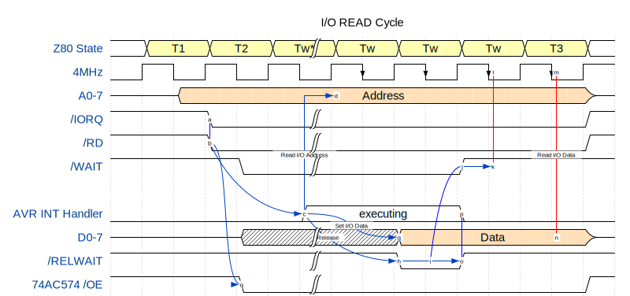
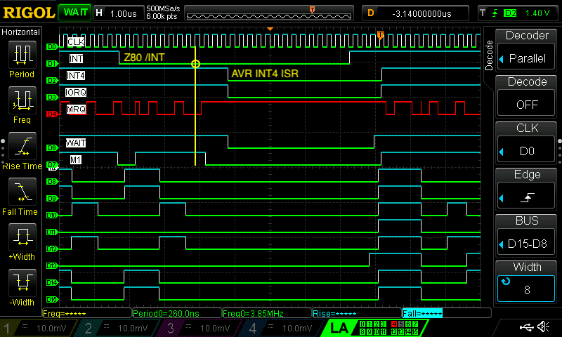

# Z80ATmega128 Board
## ハードウェア
- Z80A 4MHz (以下Z80)
- 共有メモリ 64KB (256Kbit SRAM x 2)
- AVR ATmega128-16AU 16MHz (以下AVR)
   - Z80のI/Oサブシステムとして使用
   - 2CH シリアルインターフェース
   - SPI接続のmicroSD Cardインターフェース

## 基本方針
- Z80上でプログラムをネイティブ動作させる。CP/M 2.2が動作するのが目標。
- SRAMをAVRとZ80で共有する。
- ROMは使用しない。Z80のブートストラップコードは、AVRが事前にSRAM上に配置する。
- SRAM以外のZ80の周辺I/OデバイスはAVRでエミュレートする。
- DISK I/OはmicroSDカードでエミュレートする。

## 電源
外部から5Vを供給する。
microSD Cardインターフェースは、5Vから三端子レギュレータで生成した3.3Vを使用する。それ以外はすべて5Vで動作する。

## CPUクロック
### Z80 clock
Z80Aのクロック規定は以下。
 |$\phi$||Min|Max|
 |-|-|-|-|
 |Lowレベル|$V_{ILC}$|$0.3V$|$0.45V$|
 |Highレベル|$V_{IHC}$|$V_{CC}-0.6=4.4V$|$V_{CC}+0.3=5.3V$|
 |周期|$t_C$|$250ns$|$t_{W(\phi H)}+t_{W(\phi L)}+t_r+t_f$|
 |Highパルス幅|$t_{W(\phi H)}$|$110ns$||
 |Lowパルス幅|$t_{W(\phi L)}$|$110ns$|$2000ns$|
 |立ち上がり, 立ち下がり|$t_r$, $t_f$||$30ns$|

8MHzのコルピッツ発振回路をD-FF(74HC74)で2分周したDuty 50%の $\phi=4MHz$のクロックが供給される。  
  

### AVR clock
セラミック振動子で16MHzのクロックを供給する。  
有効にするには以下のFuse設定が必要。
- CKSEL0, SUT1-0  
  - 外部セラミック振動子、低速上昇電源
  - CKSEL0=1, SUT1-0=00 : リセットからの付加遅延時間65ms
- CKSEL3-1
  - 外部セラミック振動子を使用するので値は111

詳細は[Fuse Bits](#fuse-bits)を参照。

## リセット回路
以下をサポートする。
- パワーオンリセット、リセットボタンによるマニュアルリセット。AVR、Z80の両方に適用される。
- ISPによるAVRのリプログラム時に駆動されるリセット。AVRのみに適用される。
- AVRのGPIO操作によるZ80のリセット。

Z80にはROMがないため、リセット時、SRAMの0番地にはブートストラップコードが存在している必要がある。このコードの配置はAVRが行う。パワーオンおよびマニュアルリセット時に、Z80をAVRよりも遅れて起動させるため、Z80にはAVRよりも長いリセット信号を与えている。
/RESETがLowの時、Z80の制御信号を含むバスは無効(ハイインピーダンス)になるので、AVRはバスを占有できる。この期間を利用してブートストラップコードを配置する。ただし/BUSACKはプルアップされているのでHighになってしまいバスが解放されない。このため/BUSACKはそのまま使わずに、/RESETとANDを取ってから使用するようにしている。

回路簡略化のため、パワーオンリセットと、マニュアルリセットを同時にサポート可能な[DS1232N](https://akizukidenshi.com/catalog/g/gI-15313/)を利用している。生成するリセットパルスは250ms(min)で、AVRはこれをそのまま使用し、Z80はカスケード接続で得られる500ms(min)のパルスを使用する。AVRは250msの時間差の中でペリフェラルのセットアップとZ80のプログラムの配置を終わらせる。
実際にはこの時間差はFuse bitのCKSEL0, SUT1,0の設定で変化することに注意。リセットからの付加遅延時間が設定できるからである。例えばCKSEL0=1, SUT01=00なら遅延時間は65msでなので、時間差は185msになる。([Fuse Bits](#fuse-bits)参照)
ブートストラップコードの転送には時間がかかるので、実際には0番地にHALT命令を書き込んで起動直後はHALT状態にさせ、コードをゆっくり書き込んでAVRからリセットをかけるのが現実的である。

ちなみに、リセット直後/BUSRQをにする方法は使えない。その状態でもZ80は0番地の命令をフェッチ、実行してからバスを解放する。命令は不定なのでシステムの動作に影響を与えてしまう可能性がある。Z80の起動タイミングをAVRより確実に遅らせるためには、/RESETをLowに保持したまま起動を止めておく必要がある。

DS1232Nにはウォッチドックタイマー機能があり、OFFすることができない。150ms毎に/STにパルスを投入しないとリセットパルスが生成されてしまうため、Z80用の4HMzのクロック信号を入力している。

ISPによるリプログラム時には、AVRのリセット信号が駆動される。RX0,TX0,SCKを共用しているため、スリーステートゲートでリセット信号を使って排他制御を行っている。ISPのリセット信号はプルアップが必要。ただし[ISP接続時のReset Lineのプルアップ抵抗の制限](https://onlinedocs.microchip.com/pr/GUID-BEB648AA-8539-418A-9EFB-118BDC9DC77B-en-US-1/index.html?GUID-28E6AE85-17D2-45FA-A3CC-FE1B4DC3E00F)により、4.7K以上にする必要がある。10Kでプルアップしている。


## Z80出力信号のプルアップ
本回路は全て $V_{cc}=5V$ で動作させている。Z80はTTL出力なので、CMOS標準ロジックIC入力のHレベルと合致しない。Z80からCOMSへの入力信号には基本プルアップが必要である。
| I/O |Level |  TTL |  CMOS (@5.0V)     |
| --- | ---- | -----| ----------------- |
| In  | High | >2.0 |  >0.35 (=0.7x5.0) |
| In  | Low  | <0.8 |  <1.0  (=0.2x5.0) |
| Out | High | >2.4 |  >4.2  (=5.0-0.8) |
| Out | Low  | <0.4 |  <0.4             |

AVRがバスマスタのとき、/BUSACKはLowになり、Z80のほぼ全ての入出力信号はハイインピーダンスになる。/RD, /WR, /MREQ, /IORQ, /M1, /BUSACKは標準ロジックICに接続されており、入力が不定にならないようプルアップが必要である。

## DMA
SRAMはZ80とAVRで共有されている。AVRがSRAMアクセス、すなわちDMA(Direct Memory Access)を行う場合、バスの排他制御が必要になる。本回路では、Z80の/BUSRQと/BUSACKでそれを実現している。  
AVRがDMAを行う場合、Z80に対し/BUSRQをLowにして使用権を要求する。Z80は/BUSACKをLowにすることでバスの使用権をAVRに明け渡したことを知らせる。このときZ80の入出力信号はハイインピーダンスになる。AVRはバスの使用が完了したら/BUSRQをHighにし、バスの使用権をZ80に戻す。

本回路では、Z80からAVRへのI/Oサイクル、およびAVRからZ80への割り込み要求で、AVRに割り込みを発生させる。AVRの割り込みハンドラ内では/BUSRQの要求をしてはならない。これはZ80のI/Oサイクル中、あるいは割り込みサイクル中は、AVRはSRAMにアクセスできないことを意味する。
Z80は現在実行中のマシンサイクルが終了するタイミングで/BUSRQを受け付ける。つまり、割り込みハンドラ内で自動挿入される/WAITをリセットして現在のマシンサイクルが完了させる前に/BUSRQを要求すると、永久に受け付けられずにデッドロックに陥る。

## バスの排他制御
AVRはDMAだけでなくI/Oデバイスのエミュレーションも行うため、Z80とバス信号が競合しないよう排他が必要である。

### データバス
74HCT574と74HCT245によりAVRとZ80のデータバスの排他を行う。Z80、SRAMはTTLレベルのため、74LSまたは入力がTTLトレラントな74HCTを使用する。

AVRがDMAを行う場合、すなわちZ80の/BUSACK=Lowの期間は、Z80の制御信号はハイインピーダンスになる。これらはプルアップされているため、74HCT574と74HCT245の/OE=Highとなり、データバスはZ80から切り離される。

Z80のI/O READと割り込み時は、それぞれI/Oデータと割り込みベクターのラッチが必要なため、74HCT574を使用する。ラッチのタイミングは、WAIT生成回路の生成する/WAIT信号の立ち上がりである。

Z80のメモリアクセス時は、74HCT245のゲートが開くので、Z80とSRAMのデータバスが直結する。AVR側のPortAはハイインピーダンスにしておかなければならない。
 


### アドレスバス
下位アドレス(A0-7)は、74AC573で排他制御を行う。
AVRがDMAを行う場合は/OE=/BUSACK=Lowなので74AC573のゲートが開き、そのラッチ出力がSRAMの下位アドレスに直結する。このときZ80のアドレスバスはハイインピーダンスである。
一方、Z80がバス使用中は、ゲートが閉じ74AC573の出力はハイインピーダンスとなる。
Z80のI/Oアクセスで、AVRはI/OアドレスのリードするためにPortFを使用する。PortFは通常はハイインピーダンスにセットされている。INT0(/IORD), INT1(/IOWR)による割り込みがAVRにかかると、割り込みハンドラ内で入力にセットしてアドレスのリードし、再びハイインピーダンスに戻す。

上位アドレス(A8-15)は、74HC244で排他制御を行う。
AVRがDMAを行う場合は/OE1=/OE2=/BUSACK=Lowなので74HC244のゲートが開き、PortC出力とSRAMの上位アドレスが直結する。このときZ80のアドレスバスはハイインピーダンスである。
一方、Z80がバス使用中は、ゲートが閉じ74HC244の出力はハイインピーダンスとなる。


## Z80のI/Oアクセス
Z80のI/O空間はAVRがソフトウェアエミュレーションする。  
I/Oサイクルが発生すると、AVRに外部割り込みをかける。同時にWAIT生成回路によってZ80のI/Oサイクルにウエイトを強制的に挿入する。AVRは割り込みハンドラでI/Oデータの入出力を行い、WAIT生成回路をリセットすることでZ80のI/Oサイクルを完了させる。

### WAIT生成回路
Z80のI/Oサイクルでは/IOREQがアクティブになってから2.5クロック程度で、また割り込みサイクルでは1.5クロック程度で、アドレスバスとデータバスのアクセスを完了させる必要がある。
I/Oサイクルでは1つのTw* が、割り込みサイクルでは2つのTw* が自動的に挿入される。しかし、AVRのソフトウェア処理でを完結させるには不十分なので、ハードウェア的に追加のTwを挿入してAVRでの処理時間を確保する。

/WAITは、I/Oサイクル(/IORQ=Low)、または割り込みサイクル(/IORQ=Lowかつ/M1=Low)を検出したら、次のマスタークロックの立ち上がりでLowになる。
AVRが/RELWAITに5ns以上のLowパルスを出力し、D-FFをリセットするまでこれは保持される。

## Z80のI/O WRITE
AVRには/IOWRによるINT1割り込みが発生する。割り込みハンドラでは以下の処理を行う。

1. PortFでアドレスバス(A0-A7)の値(I/Oアドレス)をリードする。(PortFは入力にセットされている前提。)
2. PortAを入力にセットする。
3. PortAからI/Oデータをリードする。
4. PortAをハイインピーダンスにセットする。
5. /RELWAITにLowパルスを出力する。

割り込み発生時には、74HC244はZ80→AVR方向の出力が有効なので、アドレスもデータもリード可能な状態になっている。5.で/WAITが解除されると、Z80のI/Oサイクルが完了する。


## Z80のI/O READ
AVRには/IORDによるINT0割り込みが発生する。割り込みハンドラでは以下の処理を行う。

1. PortFでアドレスバス(A0-A7)の値(I/Oアドレス)をリードする。(PortFは入力にセットされている前提。)
2. PortAを出力にセットする。
3. PortAにI/Oデータをライトする。
4. /RELWAITにLowパルスを出力する。
5. PortAをハイインピーダンスにセットする。

4.でWAIT生成回路がリセットされると、/WAITの立ち上がりで、74HCT574が3.のデータをラッチする。このデータはZ80のT3サイクルの立ち下がりでリードされる。/IORDがLowの期間は74HCT574の/OEが有効なため、PORTAへのデータ出力の前後のデータがバスに乗ってしまうが、Z80はラッチされたデータを読むので問題はない。　　

5.でPoartAをハイインピーダンスにするタイミングはデータラッチ以後であることが必要。このため割り込みハンドラ内で適切な時間調整が必要になるかもしれない。

データのラッチは/WAITの立ち上がりで行われる。次にTwステートの立ち下がりで/WAIT=Highがセンスされ、T3ステートが始まる。このT3の立ち下がりでラッチデータをリードされる。ワーストのタイミングは、Twの立ち下がり、/WAITの立ち上がり、ラッチがほぼ同時の場合。つまりTw立ち下がりからT3の立ち下がりまでの時間で、これはちょうど1クロック分。以下の合計が250ns以内であればよい。 $t_{pLH} < 200ns$ を満たせば十分なので、74HCT574を使用している。
 - /WAITの立ち上がりからラッチまでの遅延: $t_{pLH}$
 - /RDのセットアップ時間 : $T_{s\bar{\phi}(D)} = 50ns$

| $t_{pHL}$| typ  | max   | 電圧/温度 |
| -------- | ---- | ----- | -------- |
| 74HCT574  | 17ns |  30ns | 4.5V/25℃ |
| 74AC574  |  5ns | 9.5ns |   5V/25℃ |



## Z80への割り込み
Z80のすべての割り込みモード(NMI, Mode 0/1/2)をサポートする。ただし、Mode 0では1バイト命令(オペコードのみ)しか送信できない。

Z80の割り込みサイクルでも、WAIT生成回路が強制ウエイトを挿入する。/IORQはTw* の立ち下がりと同時にLowになる。これはI/Oサイクルのときよりも半クロック遅く、/WAIT生成のラッチタイミングまでのマージンは125nsしかないが、以下の合計がこれに収まっているため問題ない。
- /IORQの $t_{DL\bar{\phi}(IR)}=85ns$
- /WAIT生成回路のD-FF前のORゲート(74HC32)の $t_{pHL}=18ns$

AVRからZ80に割り込みをかける手順は以下。

1. /XINTにLowを出力し、Z80に割り込みをかける。Low出力はキープしたまま。理由は後述。
2. /INTRQでAVRにINT4割り込みがかかるので、割り込みハンドラ内で以下を実行。
3. /XINTをHighに戻す。
4. PORTAに割り込みベクターを出力する。
5. /RELWAITにLowパルスを出力する。

1.で/XINT(PD4)をLowのままにする理由は以下。  
Z80が/INT=Lowを認識するのは実行中の命令の最終ステートの立ち上がり。したがってWAITを考慮したZ80最大命令長程度のパルス幅が必要になる。だが本回路ではZ80のIN/OUT命令で強制WAITが挿入され、その解除時間はAVRの割り込みハンドラの実行時間に依存するため、命令終了のタイミングが自明でない。このため/XINTはLowのままにしておき、AVRに割り込みが確実にかかった後、すなわち割り込みハンドラの中でHighに戻す。Z80は割り込みサイクル中に/INTを見ないので問題ない。

Z80が/INTを認識して割り込みサイクルに入ると、/IORQと/M1がLowになり74HCT574のゲートが開く。同時にAVRに割り込みがかかる。/WAIT生成回路によりZ80には強制ウエイトがかかっている。割り込みハンドラ内で割り込みベクターを出力し、/RELWAITをで強制ウェイトを解除すると、74HCT574が/WAITの立ち上がりで割り込みベクターをラッチする。Z80はT3の立ち上がりで割り込みベクターをリードする。

ラッチ動作は割り込みサイクルの最終のTwの立ち下がりで行われるのがワーストケース。下記の合計が125ns以内ならば問題ない。
- 74HCT574の $t_{pHL}/t_{pHL} = 44ns$
- Z80の $t_{s\phi(D)} > 35ns$


### Mode2割り込みの動作例
割り込みレベル0x10の場合  
1. Z80の/INT(図中のINT)が/XINTによって生成される。これが認識されるのは現在実行中の命令(1番目の/M1のサイクル)の最終ステート。2番目の/M1=Lowから割り込みサイクルが開始する。/INTはAVRのINT4 ISR(割り込みハンドラ)の中で解除される。  


1.  こちらはAVRのINT4 ISR終了後に引き続き実行される割り込みサイクルの様子。/WAITの立ち上がりでラッチされた割り込みベクタ(0x20)が、/IORQ直前のステートの立ち上がりでフェッチされる。割り込みレベルが0x10の場合、ベクタとして出力する値は左1ビットシフトした0x20にしなければならないことに注意。次に現在のPCの上位バイト、下位バイトがスタックに保存される。これはRETI命令での戻り先。引き続き0x20のISRのアドレスを、ベクタテーブルから下位、上位の順に取得する。この例では、割り込みレベル0x10用ISRの先頭アドレスである0x2070がPCにセットされ、実行される。  


## Z80とSRAMのインターフェース
Z80のメモリアクセスで一番厳しいタイミングはM1サイクルなので、このリードタイミングついて評価すれば十分。

M1サイクルでのデータはT3の立ち上がりでリードされる。このため以下のタイミングを満たすSRAMが必要となる。  
- $t_{OE} < 375ns - (t_{DL\bar{\phi}(RD)} + t_{S\bar{\phi}(D)}) = 245ns$
- $t_{AA} < 500ns - (t_{D(AD)} + t_{S\bar{\phi}(D)}) = 355ns$

HM62256は最も遅い品種でも $t_{OE}=70ns$, $t_{AA}=150ns$ なので、どれを使用しても問題ない。


- (1) Z80AのT1の立ち上がりからアドレスが確定するまでの最大時間 : $t_{D(AD)} = 110ns$
- (2) Z80Aの/MREQ,/RDの立ち下がりのどちらか遅い方(/RD) : $t_{DL\bar{\phi}(RD)} = 95ns$ 
- (3) Z80Aのデータのセットアップ時間 : $t_{S\bar{\phi}(D)} = 35ns$
- (4) SRAMの/OEからDataが出力されるまでの最大時間 : $t_{OE}$
- (5) SRAMのアドレスアクセス時間 : $t_{AA}$

### READ (M1サイクル)
- 0番地での無限ループの観測例
  ```
  0000 C3 00 00      [10]    4     jp 0x0000
  ```
  - OE, WE, CS: SRAMの/OE, /WE, /CS
  - AB, CE: 74HCT245のA->B, CE
  

### WRITE
- 0x1234番地に0x55をライトの観測例
  ```
  0000 3E 55         [ 7]    4     LD A, 0x55
  0002 32 34 12      [13]    5     LD (0x1234), A
  0005 76            [ 4]    6     HALT
  ```
  - OE, WE, CS: SRAMの/OE, /WE, /CS
  - AB, CE: 74HCT245のA->B, CE
  

## AVRとSRAMのインターフェース
AVRのPortA(PA0-7)は、SRAMのアドレスバスの下位8bitおよび、データバスに接続される。PortC(PC0-7)はアドレスバスの上位8bitに接続されている。


### XMEMインターフェース
AVRのXMEMインターフェースにる外部メモリアクセスでは、PortAを下位アドレスとデータアクセスで共有する。例えばライトでは下位アドレス(A0-7)、データの順に出力されるので、トランスペアレントラッチ(74AC573)で下位アドレス(A0-7)を保持しておく必要がある。ラッチはALE(PG2)の立ち下がりで行う。

AVRのアドレスA0-7のタイミング特性は、ALEの立ち下がりに対し以下となっている。
- セットアップ時間 : $t_{AVLL} = 0.5 * t_{CLCL} - 10 = 21.25ns$
- ホールド時間 : $t_{LLAX,ST} = 5ns$
- $t_{CLCL} = 1/16MHz = 62.5ns$

ラッチのホールド時間 $t_h < t_{LLAX,ST}$ を満たす必要があるが、74HC573では間に合わないので、高速な74AC573を使用する。アドレス(A0-7)はラッチの伝播遅延時間 $t_{pHL} = 10ns$ 分だけ遅れて出力される。

* 74AC573 @ 5.0V/25℃
  |                | min  |  typ  |  max  |
  | -------------- | ---- | ----- | ----- |
  | $t_{pHL}$ (D-Q)|      | 4.5ns |  10ns |
  | $t_s$          |  4ns |       |       |
  | $t_h$          |  4ns |       |       |

* 74HC573 @ 4.5V/25℃
  |                | min  |  typ  |  max  |
  | -------------- | ---- | ----- | ----- |
  | $t_{pHL}$ (D-Q)|      | 14ns  |  22ns |
  | $t_s$          | 10ns |       |       |
  | $t_h$          |  5ns |       |       |

/WR (PG0), /RD (PG1)は、Z80との排他用スリーステートバッファ(74HC125)を通るため、伝播遅延時間 $t_{pHL} = 18ns$ だけ遅れて出力される。

* 74HC125 @ 4.5V/25℃
  |                    | typ  | max  |
  | ------------------ | ---- | ---- |
  | $t_{pHL}, t_{pLH}$ | 11ns | 18ns |

### READ
SRAMのアクセスタイムにより、AVR側のWAIT設定の考慮が必要となる。

WAITを0/1/2で変化させた結果が以下。  
$t_{LLRL}$には74HC125の伝播遅延時間 $t_{pHL}=18ns$(max)が、 $t_{AA}$には74AC573の伝播遅延時間 $t_{pHL}=10ns$(max) 追加されることに注意。

- $t_{LLRL} = 0.5 * t_{CLCL} - 15 ＋ 18 = 34.25ns$
- $t_{DVRH} = 40ns$
- $t_{pHL} = 10ns$ (74AC573の伝播遅延時間)

* 0 WAITの場合
  - $t_{RLRH} = 1.0 * t_{CLCL} - 10 = 52.5ns$
  - $t_{AA} < t_{LLRL} + t_{RLRH} - t_{DVRH} - t_{pHL} = 36.75ns$
  - $t_{OE} < t_{RLDV} = 1.0 * t_{CLCL} - 50 = 12.5ns $

* 1 WAITの場合
  - $t_{RLRH} = 2.0 * t_{CLCL} - 10 = 115ns$
  - $t_{AA} < t_{LLRL} + t_{RLRH} - t_{DVRH} - t_{pHL} = 96.25ns$
  - $t_{OE} < t_{RLDV} = 2.0 * t_{CLCL} - 50 = 75ns$

* 2 WAITの場合
  - $t_{RLRH} = 3.0 * t_{CLCL} - 10 = 177.5ns$
  - $t_{AA} < t_{LLRL} + t_{RLRH} - t_{DVRH} - t_{pHL} = 161.75ns$
  - $t_{OE} < t_{RLDV} = 3.0 * t_{CLCL} - 50 = 137.5ns$

$t_{AA}$と $t_{OE}$を満たすSRAMを選択し、それに応じたXMEMインターフェースのWAIT設定を行う必要がある。  
以下にSRAM(HM62256)の品種と必要なWAITの関係を示す。
|             | $t_{AA}$ | $t_{OE}$ | WAIT |
| ----------- | ---------| -------- | ---- |
| HM62256B-5  |    55ns  |   30ns   |   1  |
| HM62256B-7  |    70ns  |   40ns   |   1  |
| HM62256B-8  |    85ns  |   45ns   |   1  |
| HM62256A-8  |    85ns  |   45ns   |   1  |
| HM62256A-10 |   100ns  |   50ns   |   2  |
| HM62256A-12 |   120ns  |   60ns   |   2  |
| HM62256A-15 |   150ns  |   70ns   |   2  |

以下はアドレス0x12をREADした時の結果。  
  

### WRITE
WRITEはタイミングに余裕があり、どの型番の組み合わせでも問題ない。SRAMの型番はREADのタイミング制約に合わせて決めればよい。

参考までに計算結果とWAITの関係を以下に示す。

* 1 WAITの場合
  - データのセットアップ時間 : $t_{DW} < t_{WHDX} = 2.0 * t_{CLCL} = 125ns$
  - データのホールド時間 : $t_{DH} < t_{WHDX} = 1.0 * t_{CLCL} - 15 = 52.5ns$
  - /WEのパルス幅 : $t_{WP} < t_{WLWH} = 2.0 * t_{CLCL} - 10 = 115.5ns$

* 2 WAITの場合
  - データのセットアップ時間 : $t_{DW} < t_{WHDX} = 3.0 * t_{CLCL} = 187.5ns$
  - データのホールド時間 : $t_{DH} < t_{WHDX} = 1.0 * t_{CLCL} - 15 = 52.5ns$
  - /WEのパルス幅 : $t_{WP} < t_{WLWH} = 3.0 * t_{CLCL} - 10 = 177.5ns$

|             | $t_{DW}$ | $t_{DH}$ | $t_{WP}$ |
| ----------- | ---------| -------- | -------- |
| HM62256B-5  |    25ns  |    0ns   |   35ns   |
| HM62256B-7  |    30ns  |    0ns   |   50ns   |
| HM62256B-8  |    35ns  |    0ns   |   55ns   |
| HM62256A-8  |    40ns  |    0ns   |   55ns   |
| HM62256A-10 |    40ns  |    0ns   |   60ns   |
| HM62256A-12 |    50ns  |    0ns   |   70ns   |
| HM62256A-15 |    60ns  |    0ns   |   90ns   |

以下はアドレス0x12に0x34をWRITEした時の結果。  
  

## AVRの設定
### Fuse Bits
* Extended Fuse Byte  
    |       | bit | Value |                      |
    |-------|-----|-------|----------------------|
    | M103C |  1  |   1   |ATmega103互換モードを解除|
    | WDTON |  0  |   1   |WDT有効                |

* Fuse High Byte
    |           | bit | Value |                           |
    |-----------|-----|-------|---------------------------|
    | OCDEN     |  7  |   1   |OFF                        |
    | JTAGEN    |  6  |   1   |JTAG OFF                   |
    | SPIEN     |  5  |   0   |SPIプログラム許可           |
    | CKOPT     |  4  |   0   |外部接続のセラロック16MHz    |
    | EESAVE    |  3  |   0   |チップ消去からEEPROMを保護   |
    | BOOTSZ1-0 | 2-1 |   00  |ブートローダー 4K           |
    | BOOTRST   |  0  |   1   |リセット時はユーザーアプリを実行|

    CP/M BIOSをEEPROMに書き込んでいる場合、AVR側のファームウェア書き換え時のチップ消去でBIOSが消えてしまうのを防ぐため、EESAVEを有効にしている。

* Fuse Low Byte
    |          | bit | Value |                       |
    |----------|-----|-------|-----------------------|
    | BODLEVEL |  7  |  0    |BOD検出電圧=4.0V        |
    | BODEN    |  6  |  0    |BOD有効                |
    | SUT1-0   | 5-4 |  00   |[AVR clock](#avr-clock)|
    | CKSEL3-1 | 3-1 |  111  |[AVR clock](#avr-clock)|
    | CKSEL0   |  0  |  1    |[AVR clock](#avr-clock)|

    [AVRの電圧が下がるとEEPROMのデータが壊れる問題](https://microchip.my.site.com/s/article/Prevent-EEPROM-corruption)の回避のためBODを有効にする。
    BODLEVELはデフォルト2.7Vだが、4.0Vでリセット状態に遷移するように変更する。

最終的な値は以下となる。  
値の変更はMicrochip StudioのDevice ProgrammingメニューからISP経由で行える。
|                    |  Value  |(Default)|
|--------------------|---------|---------|
| Extended Fuse Byte |  0xFF   | (0xFD)  |
| Fuse High Byte     |  0xC1   | (0x99)  |
| Fuse Low  Byte     |  0x0F   | (0xE1)  |

### IO Port
#### PortA
PA0-7はデフォルトでハイインピーダンスにセットしておく。
* AVRがDMAを行うとき  
  XMEMインターフェースを有効にすることで出力にセットされる。下位アドレス(A0-7)出力、およびデータ(D0-7)出力として使用される。DMAが完了したらハイインピーダンスに戻す。
* Z80のI/O READのとき  
  AVRに/INT0割り込みがかかるので、割り込みハンドラ内で出力にセットし、I/Oデータをライトする。完了したらハイインピーダンスに戻す。
* Z80のI/O WRITEのとき  
  AVRに/INT1割り込みがかかるので、割り込みハンドラ内で入力にセットし、I/Oデータをリードする。完了したらハイインピーダンスに戻す。

#### PortB
* PB0 (/SS)  
  汎用SPIの/SSとして使用する。microSD Cardの/CSに接続する。
* PB1 (SCK)  
  SPI Programming InterfaceのSCK、および汎用SPIのSCKとして使用する。両者は74HC125のスリーステートゲートで排他制御される。ISPの/RSTがLowの時以外は汎用SPIのSCKが選択される。
* PB2 (MOSI)  
  汎用SPIのMOSIとして使用する。microSD CardのCMDに接続する。
* PB3 (MISO)  
  汎用SPIのMISOとして使用する。microSD CardのDATに接続する。
* PB4  
  常に入力にセットする。LowでmicroSD Cardが挿入されている。
* PB5  
  常に出力にセットする。初期値はHighにセットする。Z80への/RESETパルス生成用。
* PB6  
  常に出力にセットする。初期値はHighにセットする。Z80への/NMI割り込みパルス生成用。
* PB7  
  常に入力にセットする。Z80の/HALT信号のモニタ用。


#### PortC
PC0-7は常に出力にセットしておく。  
AVRがDMAを行うとき、XMEMインターフェース機能により上位アドレス(A8-15)出力として使用される。

#### PortD
* PD0 (/INT0)  
  Z80のI/O READ要求時のAVRへの割り込み信号。
* PD1 (/INT1)  
  Z80のI/O WRITE要求時のAVRへの割り込み信号。
* PD2 (RXD1)  
  UART CH1受信として使用
* PD3 (TXD1)  
  UART CH1送信として使用
* PD4  
  常に出力にセットする。初期値はHighにセットする。  
  Z80への/INT出力。Lowパルス生成でZ80に割り込みをかける。
* PD5  
  常に出力にセットする。初期値はHighにセットする。  
  /WAIT生成回路のリセット用。Lowパルス生成で/WAIT信号が解除される。
* PD6  
  常に出力にセットする。初期値はHighにセットする。  
  Z80への/BUSRQ出力。DMA要求時にLowレベルにホールドする。DMA完了時にはHighレベルに戻す。
* PD7  
  常に入力にセットする。  
  Z80の/BASACKをモニタ可能。

#### PortE
* PE0 (RXD0/MOSI)  
  UART CH0受信、およびSPI Programming InterfaceのMOSIとして使用する。両者は74HC125のスリーステートゲートで排他制御される。リセット信号がHighの時にはRXD0が選択される。
* PE1 (TXD0/MISO)  
  UART CH0送信、およびSPI Programming InterfaceのMOSIとして使用する。両者は74HC125のスリーステートゲートで排他制御される。リセット信号がHighの時にはTXD0が選択される。
* PE2
  常に入力にセットする。DIP SW3に接続されている。
* PE3
  常に入力にセットする。DIP SW4に接続されている。
* PE4 (/INT4)  
  PD4出力でZ80へ割り込み要求をかけると、Z80の割り込みサイクルにより生成されるAVRへの割り込み信号。この割り込みハンドラの中で、Z80に対し割り込みベクタを与える。
* PE5
  常に出力にセットする。LED1に接続されている。
* PE6
  常に出力にセットする。LED2に接続されている。
* PE7
  常に出力にセットする。LED3に接続されている。


#### PortF
* PF0-7  
  常に入力にセットする。Z80のI/Oアクセス時にI/Oアドレスをリードするために使用する。

#### PortG
* PG0  
  XMEMインターフェース有効時、SRAMの/WR信号として機能する。  
  XMEMインターフェース無効時は、High出力にセットする。  
* PG1  
  XMEMインターフェース有効時、SRAMの/RD信号として機能する。  
  XMEMインターフェース無効時は、High出力にセットする。  
* PG2  
  XMEMインターフェース有効時、74AC573のアドレスラッチ信号として機能する。  
  XMEMインターフェース無効時は、Low出力にセットする。  
* PG3  
  常に入力にセットする。DIP SW1に接続されている。  
* PG4  
  常に入力にセットする。DIP SW2に接続されている。

### XMEMインターフェース
SRAMアクセスのためにXMEMインターフェースを有効にするには、MCUCRのSRE(bit 7)をセットする。  
XMEMインターフェースを無効にしたら、Z80側バスとの衝突を防ぐためPORTAをハイインピーダンスにすること。これを保証するため、XMCRBのXMBK(bit 7)は0にセットされている必要がある。

#### SRAMのWAIT設定
XMCRAとMCUCRの設定で制御する。
外部メモリの全領域に対し、一括で1 or 2 WAIT設定を行うには以下のように設定する。
* WAIT設定  
  | Register |  bit      | 1 WAIT | 2 WAIT |
  |----------|-----------|--------|--------|
  | MCUCR    | SRW10 (6) |    1   |    0   |
  | XMCRA    | SRW11 (1) |    0   |    1   |

* 領域設定 (0x1100 - 0xFFFF)  
  | Register |  bit      | Value |
  |----------|-----------|-------|
  | XMCRA    | SLR0  (4) |   0   |
  | XMCRA    | SLR1  (5) |   0   |
  | XMCRA    | SLR2  (6) |   0   |

XMEMインターフェースでは外部RAM空間を2つに分けて、それぞれ異なるWAIT設定を行うことも可能である。本回路では2個の256bit SRAMを使用するので、32KBごとに領域を分割する場合の設定方法を以下に示す。
* WAIT設定  
  | Register |  bit      | 1 WAIT | 2 WAIT |                      |
  |----------|-----------|--------|--------|----------------------|
  | MCUCR    | SRW10 (6) |    1   |    0   |上位領域(0x8000-0xFFFF)|
  | XMCRA    | SRW11 (1) |    0   |    1   |上位領域(0x8000-0xFFFF)|
  | XMCRA    | SRW00 (2) |    1   |    0   |下位領域(0x1100-0x7FFF)|
  | XMCRA    | SRW01 (3) |    0   |    1   |下位領域(0x1100-0x7FFF)|

* 領域設定　（0x1100 - 0x7FFF / 0x8000 - 0xFFFF）  
  | Register |  bit      | Value |
  |----------|-----------|-------|
  | XMCRA    | SLR0  (4) |   0   |
  | XMCRA    | SLR1  (5) |   0   |
  | XMCRA    | SLR2  (6) |   1   |

#### 0x0000-0x10FFのアドレス空間へのアクセス
Z80はリセット時に0番地からプログラムを実行するため、AVRはSRAMの0x0000にブートストラップコードを配置しておかなければならない。しかしAVRではSRAMは内部メモリの直後に配置されるので、0x0000-0x10FFの空間に直接アクセスすることができない。この問題は、SRAMのアドレス空間を狭めることで発生するシャドウ効果を利用した間接的なメモリアクセスで回避できる。

XMEMインターフェース有効時、PortCはアドレスバスの上位8bitにマップされるが、XMCRBのXMM0/1/2の設定で一部のピンをGPIOとして解放することが可能である。例えばPortCの上位3bitをGPIOとして強制的に0出力させることで、SRAMの0x0000-0x1FFFをAVRの0x2000-0x3FFFにマップできる。(サンプルコードは[データシート](https://ww1.microchip.com/downloads/en/DeviceDoc/doc2467.pdf)の"Using all 64 Kbyte Locations of External Memory"を参照。)
