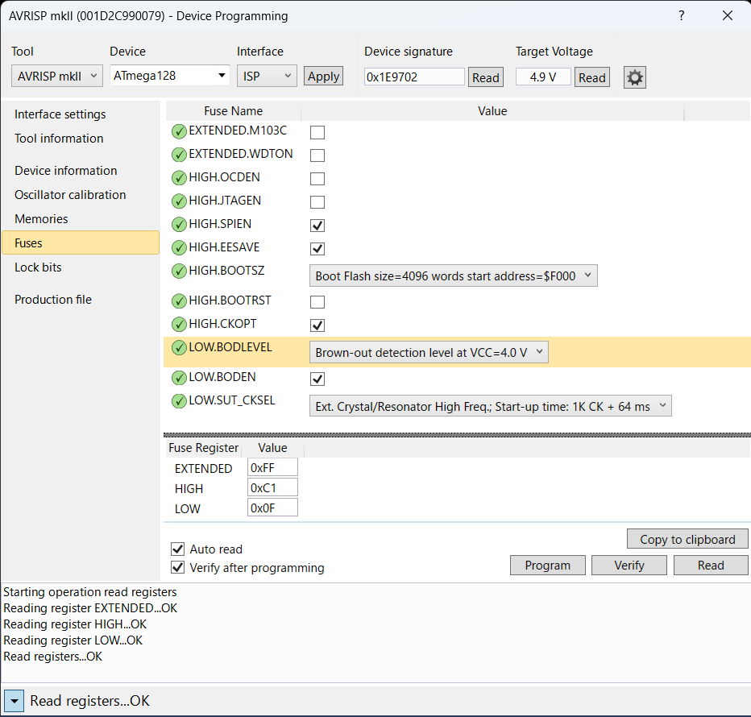
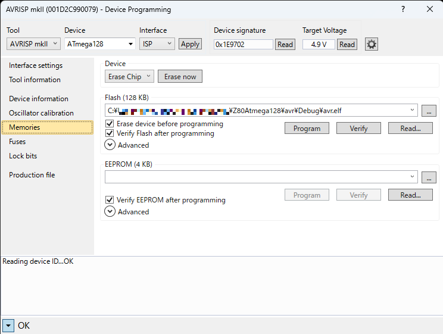

# Z80ATmega128 Board Setup Guide
Z80Atmega128 BoardでCP/M2.2を動作させる手順を以下に示す。

## 事前準備
- Windowsに[Microchip Studio](https://www.microchip.com/en-us/tools-resources/develop/microchip-studio)をインストールする。
  - Ver7.0.2594で動作確認
- [AVRISP mkII](https://www.microchip.com/en-us/development-tool/ATAVRISP2)を使えるようにしておく。
  - 純正品は製造中止なので、互換品でもかまわない。
  - ATmega128のFUSE設定とファームウェアの書き込みに使用する。
- USBシリアルの送受信ができるターミナルを使えるようにしておく。
  - プロトコル: 9600 or 19200 baud, 8bit / non parity / 1stop bitの調歩同期通信
  - XMODEM: 128byte check sum 送信が行えること。
  - ターミナルソフト: [TeraTerm](https://ttssh2.osdn.jp/index.html.en) (Windows)など
  - 通信速度はDIP SWの設定に合わせておく。

## 基板の設定
- DIP SW
  - SW 1: EEPROMにCP/M BIOSが書き込まれていない場合はOFFにする。
  - SW 2: 接続するターミナルの通信速度にあわせる。
  - SW 4: 外部SRAM(HM62256)のアクセスタイムが100nsよりも遅い場合はOFFにする。
  
  | SW # |                |   ON   |   OFF   |
  |:----:|----------------|--------|---------|
  |   1  | CP/M mode      | Enable | Disable |
  |   2  | UART baud rate |  19200 |    9600 |
  |   3  | Not used       |        |         |
  |   4  | SRAM Wait      | 1 wait |  2 wait |

## ファームウェアの書き込み
### AVRファームウェアのビルド
1. WindowsでMicrochip Studioを起動。
2. `File > Open > Project/Solution...` で、`avr/avr.atsln` を選択。
3. `Build > Build Solution` を実行。
4. エラーがないことを確認する。

### ATmega128へのファームウェアの書き込み
1. Z80ATmega128 BoardのAVR ISPコネクタにAVRISP mkIIを接続し、電源を入れる。
2. Microchip Studioを起動。
3. `Tools > Device Programming`を選択。
4. 以下のように値をセットし`Apply`を実行。
   |           |            |
   |-----------|------------|
   | Tool      | AVRISPmkII |
   | Device    | ATmega128  |
   | Interface | ISP        |
5. Deivce signatureの確認  
   `Read` を実行し、値が `0x1E9702` になればOK。  
   エラーになる場合は `Interface setting` で、`ISP Clock` を変更してみる。  
    
6. FUSEの設定  
   以下のようにセットする。(値の詳細は[こちら](Hardware/Design.md#fuse-bits))
   
7. ファームウェアの書き込み  
   `Program` を実行。 
   

### 動作確認
1. DIP SW 1はOFFにしておく。(CP/M mode OFF)
2. microSD Cardはセットしない。
3. 電源ONまたはリセットボタン押下で、プロンプトが表示されることを確認。
    ```
    SDHC mount error

    ATmega128 Tiny Monitor
    >
    ```
4. メモリテスト
    ```
    >test
    2000-2500
    write sum=7d80
    read  sum=7d80
    XMEM OK!
    ```
5. これでATmega128の動作確認が完了。

## CP/Mの設定
Z80ATmega128 BoardでCP/M-80を動作させるための手順を説明する。  


### CP/MディスクイメージとmicroSD Cardの作成
ライセンスの関係で、リポジトリにはCP/Mのソースもバイナリも置いていない。ここでは、[The Unofficial CP/M Web site](http://www.cpm.z80.de/)にある、[CP/M 2.2 BINARY](http://www.cpm.z80.de/download/cpm22-b.zip)を使用してCP/Mのディスクイメージを作成する。

1. CP/Mディスクイメージの生成 (VSCode + Dev Container環境の場合)    
  `z80/cpm22/image` で `DISK00.IMG` を生成する。これがCP/Mのディスクイメージのバイナリファイル。
    ```
    vscode@Z80ATmega128:/z80/cpm22/image$ make
    mkdir -p ./tmp
    wget -P ./tmp http://www.cpm.z80.de/download/cpm22-b.zip
    --2023-10-10 16:04:18--  http://www.cpm.z80.de/download/cpm22-b.zip
    Resolving www.cpm.z80.de (www.cpm.z80.de)... 92.205.48.95, 2a00:1169:103:9b30::
    Connecting to www.cpm.z80.de (www.cpm.z80.de)|92.205.48.95|:80... connected.
    HTTP request sent, awaiting response... 200 OK
    Length: 42510 (42K) [application/zip]
    Saving to: ‘./tmp/cpm22-b.zip’

    cpm22-b.zip                  100%[============================================>]  41.51K   124KB/s    in 0.3s    

    2023-10-10 16:04:20 (124 KB/s) - ‘./tmp/cpm22-b.zip’ saved [42510/42510]

    unzip -o -d ./tmp ./tmp/cpm22-b.zip
    Archive:  ./tmp/cpm22-b.zip
    inflating: ./tmp/CPM.SYS           
    inflating: ./tmp/DDT.COM           
    inflating: ./tmp/PIP.COM           
    inflating: ./tmp/SUBMIT.COM        
    inflating: ./tmp/XSUB.COM          
    inflating: ./tmp/ED.COM            
    inflating: ./tmp/ASM.COM           
    inflating: ./tmp/LOAD.COM          
    inflating: ./tmp/STAT.COM          
    inflating: ./tmp/DUMP.COM          
    inflating: ./tmp/DUMP.ASM          
    inflating: ./tmp/BIOS.ASM          
    inflating: ./tmp/DEBLOCK.ASM       
    inflating: ./tmp/DISKDEF.LIB       
    inflating: ./tmp/DSKMAINT.COM      
    inflating: ./tmp/READ.ME           
    rm -f ./tmp/cpm22-b.zip
    mkfs.cpm -f sdcard -b ./tmp/CPM.SYS DISK00.IMG
    dd if=/dev/zero of=DISK00.IMG bs=8192 count=1021 oflag=append conv=notrunc
    1021+0 records in
    1021+0 records out
    8364032 bytes (8.4 MB, 8.0 MiB) copied, 0.139112 s, 60.1 MB/s
    cpmcp -f sdcard DISK00.IMG ./tmp/*.* 0:
    cpmls -f sdcard DISK00.IMG
    0:
    asm.com
    bios.asm
    cpm.sys
    ddt.com
    deblock.asm
    diskdef.lib
    dskmaint.com
    dump.asm
    dump.com
    ed.com
    load.com
    pip.com
    read.me
    stat.com
    submit.com
    xsub.com
    echo `wc -c < DISK00.IMG`
    8429568
    ```
2. microSD Cardの作成
   - FAT16でフォーマットする。
   - ルートディレクトリに `DISK00.IMG` をコピーする。これは必ず存在する必要がある。
     - `00`はドライブA:に相当する。`15`(ドライブP:)まで指定可能。
     - 例えば `DISK00.IMG` を `DISK01.IMG` としてコピーし追加すれば、B:ドライブが見えるようになる。

### CP/M自動起動のための設定
microSD CardからCP/Mが起動できるようにするための設定を行う。

1. BIOSのビルド (VSCode + Dev Container環境の場合)  
   `z80/cpm22` で `bios.ihx` を生成する。これはIntel HEX formatのファイル。
    ```
    vscode@Z80ATmega128:/z80/cpm22$ make bios.ihx
    asz80 -l -o  bios.asm
    
    aslink -i bios.ihx bios.rel
    
    ASlink >> -i
    ASlink >> bios.ihx
    ASlink >> bios.rel
    ```

2. EEPROMへのBIOSの書き込み
   1. AVR Tiny Monitorの`xload`コマンドで、Intel HEXフォーマットのBIOSをSRAM上にバイナリ展開する。シリアル端末からXMODEMで `bios.ihx` を送信する。62K CP/M用BIOSなので、バイナリは0xf200から配置される。
        ```
        >xload
        Start XMODEM within 90s...

        Received 2816 bytes.
        ```
   2. EEPROMにダウンロードしたBIOSイメージをATmega128のEEPROMの0番地に転送する。終了するまで少し時間がかかる。先頭4バイトにはBIOSの先頭アドレス(0xf200)と長さ(0x00b0)が書き込まれる。
        ```
        >esave2 0 $f200 2816
        >
        ```

### 動作確認
  1. CP/Mイメージファイルを書き込んだmicroSD Cardをスロットに挿入する。
  2. DIP SW 1をONにしてリセットボタンを押す。
  3. AVR側はCP/M modeで起動する。  
     EEPROMに書き込まれたBIOSがSRAM上にコピーされ、BIOSがmicroSD Cardの予約トラックに書き込まれているCCP+BDOSを読み込んで、CP/Mを起動する。
     ```
     === CP/M mode ===
     BIOS: 0xf200 - 0xfcff
     
     ATmega128 Tiny Monitor
     >
     ```
     Z80側のコンソールに以下が表示されれば成功。
     ```
     62K CP/M-80 Ver2.2 on Z80ATmega128
     BIOS Copyright (C) 2023 by 46nori
     
     A>
     ```