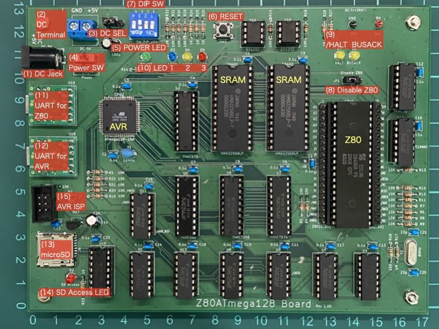
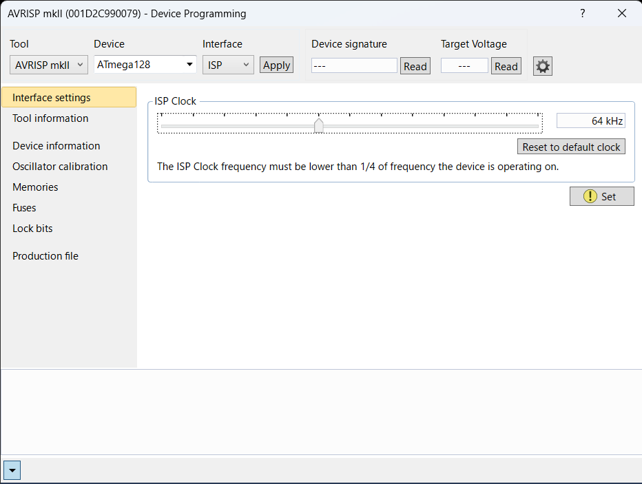
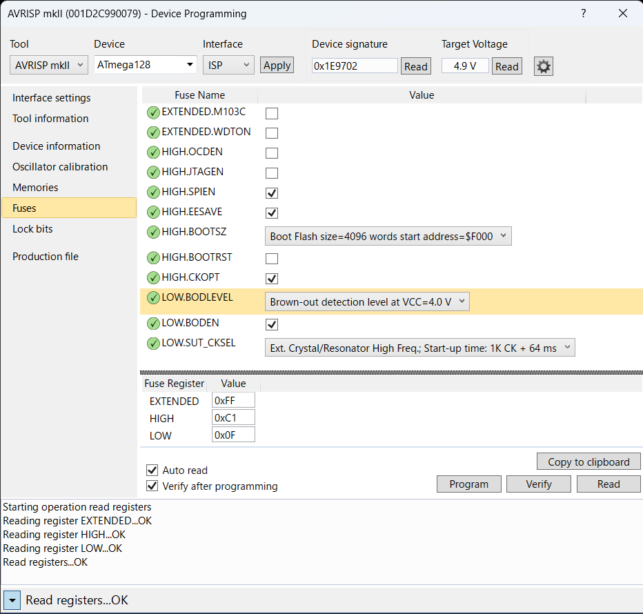
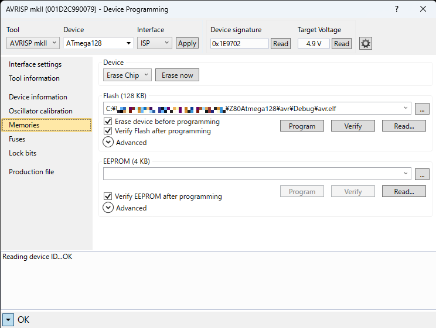

# Z80ATmega128 Board Setup Guide
The procedure for setting up the firmware on the Z80Atmega128 Board and booting CP/M2.2 is shown below.

## Component Mounting Diagram


| No.|                   |                                               |
|:--:|-------------------|-----------------------------------------------|
|(1) | DC Jack           | +5V external power supply (for AC adapter)    |
|(2) | DC Terminal       | +5V external power supply terminal            |
|(3) | DC Select         | Jumper pin for selecting (1)/(2)              |
|(4) | POWER SW          | Power SW                                      |
|(5) | POWER LED         | Power LED indicator                           |
|(6) | RESET             | System reset                                  |
|(7) | DIP SW            | [Detail](#dip-sw)                             |
|(8) | Disable Z80       | Jumper Pin for Z80 force suspend<br>/BUSREQ=L |
|(9) | /HALT BUSACK LED  | Z80/HALT=L,/BUSACK=H                          |
|(10)| LED 1 / 2 / 3     | [Detail](#led)                                |
|(11)| UART1 for Z80     | USB-C Serial Interface for Z80                |
|(12)| UART0 for AVR     | USB-C Serial Interface for AVR                |
|(13)| microSD Card slot | microSD card slot                             |
|(14)| SD Access LED     | microSD card access LED indicator             |
|(15)| AVRISP Connector  | AVRISPmkII connector                          |

### Power supply
- A current supply capacity of at least 300mA is necessary.
- Do not exceed 5.5V; there is no overvoltage protection circuit.
- Power can be provided through the DC Jack, External Power Terminal, or the USB-C for UART.

### DIP SW
|  #  | Function       |   ON   |   OFF   |
|:---:|----------------|--------|---------|
|  1  | CP/M mode      | Enable | Disable |
|  2  | UART baud rate |  19200 |    9600 |
|  3  | Not used       |        |         |
|  4  | SRAM Wait      | 1 wait |  2 wait |

- SW1: If turned ON, CP/M will start automatically upon powering up, provided the BIOS has been written to the AVR EEPROM.
- SW2: Select baud rate to match the connected terminal.
- SW4: Tuen ON if SRAM(HM62256) access time is faster than 100ns.

### LED
|  #  | Color  | Status                           |
|:---:|--------|----------------------------------|
|  1  | Blue   | microSD is opening or fail       |
|  2  | Yellow | Not used                         |
|  3  | Red    | AVR heartbeat (blinking at 2 Hz) |

### Notes
- PCB Rev1.00 has a bug in the wiring and needs to be fixed.
  - [Front Plane](./Hardware/PCB/PCB1.0-FP-Errata.pdf): 7 pattern cuts
  - [Back Plane](./Hardware/PCB/PCB1.0-BP-Errata.pdf): 1 pattern cut, 6 patch wires
- PCB Rev2.00, The silk printing of U18 and U19 are incorrect.

## 1. Preparation
- Install [Microchip Studio](https://www.microchip.com/en-us/tools-resources/develop/microchip-studio) on Windows.
    - Verified to work with version 7.0.2594.
- Ensure the [Microchip Studio](https://www.microchip.com/en-us/tools-resources/develop/microchip-studio) is ready for use.
    - Genuine device have been discontinued, so compatible alternatives are acceptable.
    - It will be used for configuring ATmega128's FUSE settings and firmware flashing.
- Prepare a terminal capable of serial communication (ideally, two channels).
    - Protocol: 9600 or 19200 baud, 8-bit / non-parity / 1-stop bit,  asynchronous
    - Set the baud rate to match the DIP switch configuration.
    - XMODEM with 128-byte checksum transmission should be supported.
    - Terminal software example: [TeraTerm](https://ttssh2.osdn.jp/index.html.en) (for Windows)

## 2. Flashing AVR Firmware
This section describes the steps to burn the firmware into the Z80ATmega128 Board and to run the monitor program.

### 2-1. Building AVR Firmware
1. Start Microchip Studio on Windows.
2. Choose `File > Open > Project/Solution ... `, select `avr/avr.atsln`.
3. Run `Build > Build Solution`.
4. Check for no error.

### 2-2. Flashing Firmware to ATmega128
1. Connect the AVRISP mkII to the AVRISP connector on the Z80ATmega128 Board and power it on.
2. Start Microchip Studio.
3. Choose `Tools > Device Programming`.
4. Set the values as follows and execute `Apply`:
   | Setting   | Value      |
   |-----------|------------|
   | Tool      | AVRISPmkII |
   | Device    | ATmega128  |
   | Interface | ISP        |
5. Check Deivce signature  
   `Read` and the check the value is `0x1E9702`.  
   If you get an error, select `Interface setting` and try changing `ISP Clock` lower.  
    
6. Configuring FUSE  
   Set as follows. (For details on the settings, see [here](./Hardware/Design.md#fuse-bits).)
   
7. Flashing Firmware  
   Run `Program`. 
   

### 2-3. Functionality Test
1. Turn OFF the DIP SW1 to disable CP/M mode.
2. Do not insert the microSD Card into the slot.
3. Connect the serial interface for AVR to the terminal software.
4. Verified the prompt appears when the power is ON or the reset button is pressed.
    ```
    ATmega128 Tiny Monitor
    >
    ```
5. Memory Test
    ```
    >test
    2000-2500
    write sum=7d80
    read  sum=7d80
    XMEM OK!
    ```
6. This completes the test of the Z80ATmega128 Board.

## 3. CP/M settings
The procedure for operating the CP/M-80 on the Z80ATmega128 Board is described below.  

Due to licensing, neither the source nor the binary of the CP/M is provided in this repository. In this section, you will create a CP/M disk image using the [CP/M 2.2 BINARY](http://www.cpm.z80.de/download/cpm22-b.zip) located at [The Unofficial CP/M Web site](http://www.cpm.z80.de/).

### 3-1. Setup Build Environment
Linux is required for BIOS build and the CP/M disk image generation.
VS Code + Dev Container environment is recommended for Windows and macOS.

#### Linux (Debian12)
1. apt install
   ```
   sudo apt-get install -y less tree wget git make unzip bzip2 g++ gcc bsdmainutils cpmtools
   ```
2. Install Z80 cross assembler(asxxxx)
   ```
   cd z80/toolchain
   make
   ```

#### VS Code + Dev Container
- Install [Docker Desktop](https://www.docker.com/products/docker-desktop/)
- Install [VS Code](https://azure.microsoft.com/en-us/products/visual-studio-code/)
- Install `Dev Containers` plugin of VS Code
- Open bash in Dev Container

### 3-2. Creating a CP/M Disk Image for microSD Card
1. Generating a CP/M Disk Image (VSCode + Dev Container Environment)    
  Generate `DISK00.IMG` with `z80/cpm22/image`, which is the CP/M disk image binary file.
    ```
    vscode@Z80ATmega128:/z80/cpm22/image$ make
    mkdir -p ./tmp
    wget -P ./tmp http://www.cpm.z80.de/download/cpm22-b.zip
    --2023-10-10 16:04:18--  http://www.cpm.z80.de/download/cpm22-b.zip
    Resolving www.cpm.z80.de (www.cpm.z80.de)... 92.205.48.95, 2a00:1169:103:9b30::
    Connecting to www.cpm.z80.de (www.cpm.z80.de)|92.205.48.95|:80... connected.
    HTTP request sent, awaiting response... 200 OK
    Length: 42510 (42K) [application/zip]
    Saving to: ‘./tmp/cpm22-b.zip’

    cpm22-b.zip                  100%[============================================>]  41.51K   124KB/s    in 0.3s    

    2023-10-10 16:04:20 (124 KB/s) - ‘./tmp/cpm22-b.zip’ saved [42510/42510]

    unzip -o -d ./tmp ./tmp/cpm22-b.zip
    Archive:  ./tmp/cpm22-b.zip
    inflating: ./tmp/CPM.SYS           
    inflating: ./tmp/DDT.COM           
    inflating: ./tmp/PIP.COM           
    inflating: ./tmp/SUBMIT.COM        
    inflating: ./tmp/XSUB.COM          
    inflating: ./tmp/ED.COM            
    inflating: ./tmp/ASM.COM           
    inflating: ./tmp/LOAD.COM          
    inflating: ./tmp/STAT.COM          
    inflating: ./tmp/DUMP.COM          
    inflating: ./tmp/DUMP.ASM          
    inflating: ./tmp/BIOS.ASM          
    inflating: ./tmp/DEBLOCK.ASM       
    inflating: ./tmp/DISKDEF.LIB       
    inflating: ./tmp/DSKMAINT.COM      
    inflating: ./tmp/READ.ME           
    rm -f ./tmp/cpm22-b.zip
    mkfs.cpm -f sdcard -b ./tmp/CPM.SYS DISK00.IMG
    dd if=/dev/zero of=DISK00.IMG bs=8192 count=1021 oflag=append conv=notrunc
    1021+0 records in
    1021+0 records out
    8364032 bytes (8.4 MB, 8.0 MiB) copied, 0.139112 s, 60.1 MB/s
    cpmcp -f sdcard DISK00.IMG ./tmp/*.* 0:
    cpmls -f sdcard DISK00.IMG
    0:
    asm.com
    bios.asm
    cpm.sys
    ddt.com
    deblock.asm
    diskdef.lib
    dskmaint.com
    dump.asm
    dump.com
    ed.com
    load.com
    pip.com
    read.me
    stat.com
    submit.com
    xsub.com
    echo `wc -c < DISK00.IMG`
    8429568
    ```
2. Creating a microSD Card
   - Format the microSD card as **FAT32**.
   - Copy `DISK00.IMG` to the root directory on it. It is mandatory.
     - `00` corresponds to drive A:. You can specify up to 15 `(drive P:).
     - For example, copy `DISK00.IMG` as `DISK01.IMG` and add, B: drive will bet visible.
   - Copy `DISK00.IMG`` to the root directory. This is a mandatory step.
     - `00` corresponds to drive A:. You can specify drives up to `15`(P:).
     - For instance, if you copy `DISK00.IMG` as `DISK01.IMG`, drive B: will become visible."

### 3-3. Configuration for automatic CP/M startup
Configure settings to enable CP/M startup from the microSD Card when power on.

1. Build CP/M BIOS (VSCode + Dev Container environment)  
   Generate `bios.ihx` with `z80/cpm22/bios`. This is an Intel HEX format file.
    ```
    vscode@Z80ATmega128:/z80/cpm22/bios$ make bios.ihx
    asz80 -l -o  bios.asm
    
    aslink -i bios.ihx bios.rel
    
    ASlink >> -i
    ASlink >> bios.ihx
    ASlink >> bios.rel
    ```

2. Flashing BIOS to EEPROM
   1. Connect the AVR serial interface to the terminal.
   2. Utilize the AVR Tiny Monitor's xload command to deploy the BIOS in Intel HEX format to SRAM. Transmit `bios.ihx` by the XMODEM protocol using terminal software. As the BIOS is designed for a 62K CP/M, the binaries should be loaded starting from address 0xf200.
        ```
        >xload
        Start XMODEM within 90s...

        Received 2816 bytes.
        ```
   3. Transfer the downloaded BIOS image to address 0 of the ATmega128's EEPROM. This process may take some time to complete. The first 4 bytes of the EEPROM contain the BIOS's starting address (0xf200) and its length (0x00b0).
        ```
        >esave2 0 $f200 2816
        >
        ```

### 3-4. Functionality Test
  1. Connect the AVR and Z80 serial interfaces to the terminal.
  2. Insert a microSD card with the CP/M image file into the slot.
  3. Turn on DIP switch SW1 (CP/M start mode) and press the RESET button.
  4. The AVR serial terminal will display the following prompt. The BIOS is copied from the EEPROM to SRAM, after which the BIOS reads the CCP+BDOS from the reserved track on the microSD card and initiates CP/M.
     ```
     === CP/M mode ===
     BIOS: 0xf200 - 0xfcff
     
     ATmega128 Tiny Monitor
     >
     ```
     If the following is displayed on the Z80 serial terminal, it is successful.
     ```
     62K CP/M-80 Ver2.2 on Z80ATmega128
     BIOS Copyright (C) 2023 by 46nori
     
     A>
     ```