# CP/M BIOS Design Specification

## Overview
- 62KB BIOS
- Z80ニーモニックで記述
- Mode2 割り込みを使用
- CON: をサポート。 LST:, PUN:, RDR: は未サポート。
- DISK I/O
  - 5 ドライブ (A: to E:) をサポート 
  - Blocking and Deblocking をサポート

## Boot Sequence
AVRファームウェアは電源ONおよびリセット時に以下を実行する。
1. DIPSW-1がON、かつmicroSD CardがマウントできたらCP/Mモードで起動する。
2. EEPROMの0番地から`EntryAddress`と`Length`をリードする。 (1)
3. SRAMの0x0000番地に`JP EntryAddress`命令を書き込む。 (2)
4. EEPROM内のBIOSを`EntryAddress`に`Length`分コピーする。 (3)
5. Z80をリセットし、CP/Mを起動。
6. TinyMonitorを起動。

Z80はCP/Mを以下のように起動する。
1. 0番地のJP命令によりBIOSが起動される。
2. CCP+BDOSを`EntryAddress`にロードするために、BIOS BOOTルーチンがAVRにDISK READを要求する。  
   AVRは CCP+BDOS を microSD Card上のディスクイメージファイルのTrack 0相当から読み出し、SRAMにコピーする。
3. BIOS BOOTルーチンがCCPを起動する。



## BOOT and WBOOT
BOOTとWBOOTの違いは以下。
### BOOT
- パワーオン時のみ呼ばれる。
- Z80の割り込み設定、Emulated I/O deviceの初期化
- ドライブをA:に設定
- CCP+3番地にジャンプ

### WBOOT
- ドライブは直前まで使用していたものをセット。
- CCPの先頭にジャンプ

## DISK I/O
BDOSが指定する論理トラックと論理セクタを、絶対セクタ番号に変換して扱っている。絶対セクタの定義は以下。
`TRK`と`SEC`は、それぞれ`SETTRK`、`SETSEC`のBIOSコールで事前にセットされるものとする。
`SPT`はDPB(Disk Parameter Block)で定義される値である。詳細は[BIOSのソース](../../z80/cpm22/bios/bios.asm)と[こちら](./DiskParameters.md)を参照。
- 論理トラック番号 : `TRK`
- 論理セクタ番号 : `SCT`
- 論理トラックあたりのセクタ数 : `SPT`
- 絶対セクタ番号 : `AS` = TRK * SPT + SCT

AVRとのデータ共有用に、SRAM上に512bytesのバッファ(`DMABUF`)を確保しており、`READ`,`WRITE`のBIOSコールで排他使用する。CP/Mの論理セクタ長は128byteなので、4セクタ分、すなわちBlocking Factor=4のBlocking/Deblockingをサポートする。

### READ
READ要求を受けると、指定されたセクタが`DMABUF`に存在するかチェックする。
存在する場合は、そのセクタを`DMA_ADRS`にコピーする。
存在しない場合は、AVRに512bytesのリードを要求する。先頭128byte(1セクタ分)を`DMA_ADRS`にコピーする。残りの3セクタ分は先読みキャッシュとして保存しておく。

### WRITE
AVRのEmulated DISK I/Oは、任意のアドレスとデータ長を指定して、ディスクイメージファイルにWRITEすることができる。しかしmicroSD Cardは、512byteのセクタ境界から512byte単位でライトする必要があるため、境界が一致しなかったり、データ長が512の倍数にならない場合はRead/Modify/Writeが必要になる。
これは顕著なライト速度の低下を招くため、BIOSはなるべく512bytes境界から512bytesを書き込むように、バッファとバッファフラッシュ(AVRへのライト要求)のタイミングを管理する。

WRITE要求を受けると、以下で定義される`IDX`の位置にデータがコピーされる。
- 格納されるバッファの位置 : IDX = AS % 4
  ```
        +----------+
  IDX=0 | 128bytes |
        +----------+
  IDX=1 | 128bytes |
        +----------+
  IDX=2 | 128bytes |
        +----------+
  IDX=3 | 128bytes |
        +----------+
  ```
これがバッファフラッシュ後の**初回の**WRITE要求であれば、あわせて`IDX`とイメージファイルの書き込み先アドレスを記憶しておく。これは次のバッファフラッシュ時に使用される。

WRITE要求元は、Cレジスタに以下のDeblocking Codeをセットする。
- C = 0: deferred write
- C = 1: nondeferred write
- C = 2: deferred write to the first sector of a new data block

もしも以下のいずれか、または両方条件を満たす場合はバッファフラッシュを行う。
- C = 1
- IDX = 3
それ以外は、キャッシュされているセクタ数(0-3)をインクリメントし、リターンする。

バッファフラッシュ時は、記憶している`IDX`から`キャッシュされているセクタ数x128byte分`を、`イメージファイルの書き込み先アドレス`にライトする。


### SELDSK
Emulated DISK I/Oは、アクセスするディスクイメージを指定されたドライブのものに切り替える。

### SETTRK
論理トラック番号を`CURRENT_TRACK_NO`に保存するだけ。次回のREAD/WRITEで使用される。

### SETSEC
論理セクタ番号を`CURRENT_SECTOR_NO`に保存するだけ。次回のREAD/WRITEで使用される。

### SERDMA
データの転送アドレスを`DMA_ADRS`に保存するだけ。次回のREAD/WRITEで使用される。

### SECTRN
microSD Cardではインターリーブが不要なため、未サポート。
