# CP/M BIOS Design Specification

## Overview
- 62KB BIOS
- Written in Z80 mnemonic
- Mode2 interrupt
- CON: is supported. LST:, PUN: and RDR: are not supported.
- DISK I/O
  - 5 drives (A: to E:) is supported. 
  - Blocking and Deblocking is suppotred.

## Boot Sequence
AVR firmware behaves as below at power-on reset.
1. CP/M boot sequence is triggered if DIPSW-1 is ON and the microSD Card is mounted.
2. Read EntryAddress and Length from EEPROM. (1)
3. Set `JP EntryAddress` to 0x0000 of SRAM. (2)
4. Copy BIOS on EEPROM to EntryAddress. (3)
5. Resaet Z80.
6. Start TinyMonitor.

Z80 launches CP/M as follows:
1. Start BIOS.
2. BIOS BOOT routine requests DISK READ to AVR in order to download CCP+BDOS from EntryAddress.  
   AVR reads CCP+BDOS from Track 0 on the microSD Card and copies it to SRAM.
3. BIOS BOOT routine launches CCP.



## BOOT and WBOOT
Both routine loads CP/M(CCP+BDOS) from A: using the DISK READ routine. If loading was a failure, then halt the system. The difference between BOOT and WBOOT is as follows.

### BOOT
- Called only at power-on reset.
- Z80 interrupt settings, Emulated I/O device initialization.
- Set initial drive to A:.
- Start CCP from CCP+3.

### WBOOT
- Restore the drive previously being utilized.
- Start CCP from CCP+0.

## DISK I/O
The logical tracks and sectors specified by BDOS are converted into absolute sector numbers. The definition of absolute sector is as follows.
`TRK` and `SEC` shall be set in advance with the BIOS calls `SETTRK` and `SETSEC`, respectively. Also, `SPT` is a value defined by DPB (Disk Parameter Block).
- Logical track number: `TRK`
- Logical sector number: `SCT`
- Number of sectors per logical track: `SPT`
- Absolute sector number: `AS` = TRK * SPT + SCT

A 512-byte buffer (`DMABUF`) is reserved on SRAM for data sharing with AVR and is used exclusively by `READ` and `WRITE` BIOS calls. Since the logical sector length of CP/M is 128 bytes, it supports Blocking/Deblocking for four sectors, that is, Blocking Factor=4.

### READ
When a READ request is received, it checks whether the specified sector exists in `DMABUF`.
If it exists, copy that sector to `DMA_ADRS`.
If it does not exist, request AVR to read 512 bytes. Copy the first 128 bytes (1 sector) to `DMA_ADRS`. The remaining three sectors are saved as a read-ahead cache.

### WRITE
Emulated DISK I/O on AVR allows writing to a disk image file by specifying an arbitrary address and data length. However, microSD cards require writing in 512-byte units from 512-byte sector boundaries, so if the boundaries do not match or the data length is not a multiple of 512, Read/Modify/Write is required.
This causes a noticeable write performance reduction, so the BIOS manages the timing of buffers and buffer flushes (write requests to AVR) to write 512 bytes from the 512-byte boundary as much as possible.

When a WRITE request is received, the data is copied to the `IDX` location defined below.
- Location of stored buffer: IDX = AS % 4
  ```
        +----------+
  IDX=0 | 128bytes |
        +----------+
  IDX=1 | 128bytes |
        +----------+
  IDX=2 | 128bytes |
        +----------+
  IDX=3 | 128bytes |
        +----------+
  ```
If this is **the first** WRITE request after flushing the buffer, also remember `IDX` and `image file write destination address`. This will be used during the next buffer flush.

The caller of the WRITE request sets the following Deblocking Code in the C register.
- C = 0: deferred write
- C = 1: nondeferred write
- C = 2: deferred write to the first sector of a new data block

If any or both of the following conditions are met, flush the buffer. Otherwise, increment the number of cached sectors (0-3) and return.
- C=1
- IDX=3

When flushing the buffer, write `the number of cached sectors x 128 bytes` from the stored `IDX` to the `image file write destination address`.

### SELDSK
Emulated DISK I/O switches the accessed disk image to that of the specified drive.

### SETTRK
Just save the logical track number in `CURRENT_TRACK_NO`. It will be used in the next READ/WRITE.

### SETSEC
Just save the logical sector number in `CURRENT_SECTOR_NO`. It will be used in the next READ/WRITE.

### SERDMA
Just save the data transfer address in `DMA_ADRS`. It will be used in the next READ/WRITE.

### SECTRN
It is not supported since interleave is unnecessary for accessing microSD Cards.
