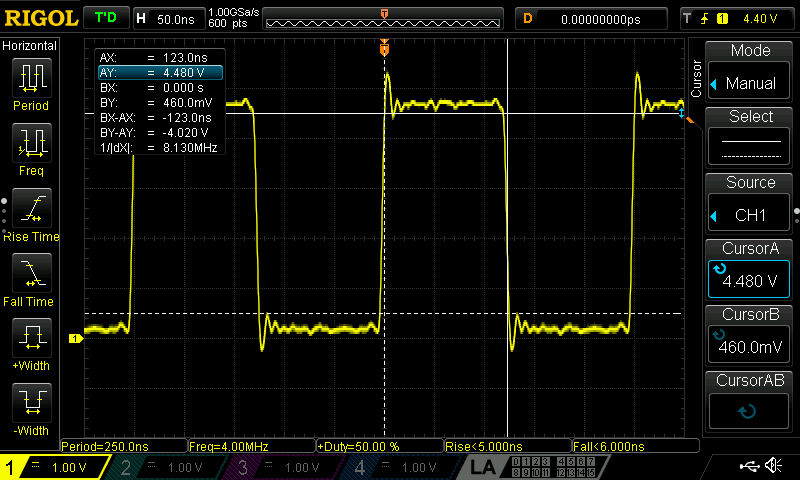
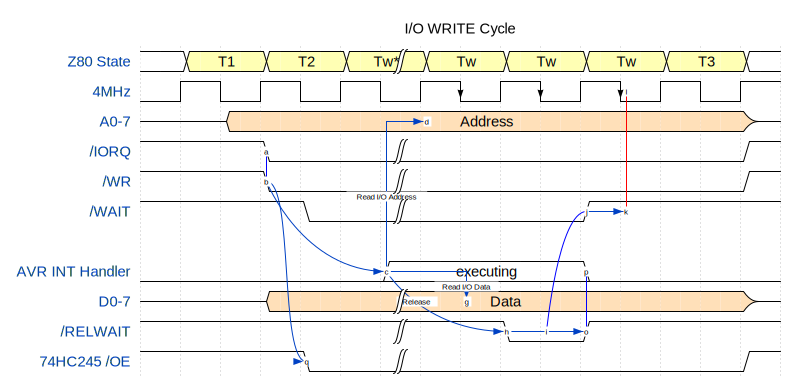
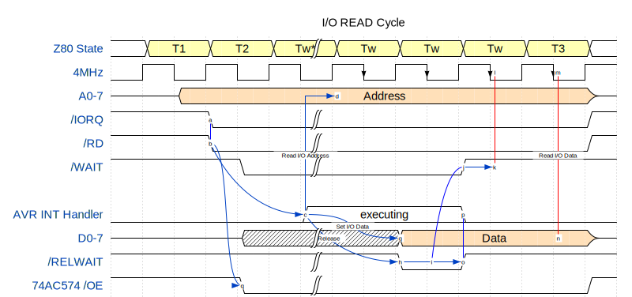
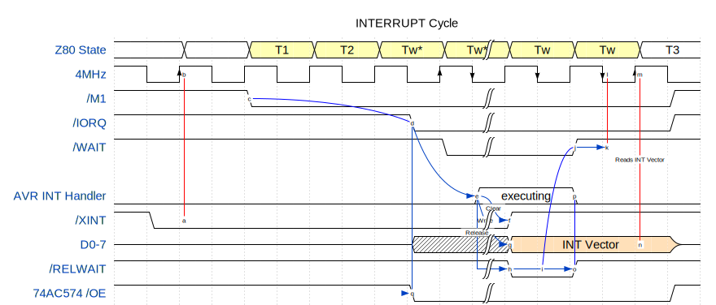

# Z80-ATmega128 Board
## ハードウェア
- Z80A 4MHz (以下Z80と呼称)
- 共有メモリ 64KB (256Kbit SRAM x 2)
- AVR ATmega128 16MHz (以下AVRと呼称)
   - Z80のI/Oサブシステムとして使用
   - 2CH シリアルインターフェース
   - SPI接続のmicroSD Cardインターフェース

## 基本方針
- Z80上でプログラムをネイティブ動作させる。CP/M 2.2が動作するのが目標。
- SRAMをAVRとZ80で共有する。
- ROMは使用しない。Z80のブートストラップコードは、AVRが事前にSRAM上に配置する。
- SRAM以外のZ80の周辺I/OデバイスはAVRでエミュレートする。

## 電源
外部から5Vを供給する。
microSD Cardインターフェースは、5Vから三端子レギュレータで生成した3.3Vを使用する。それ以外はすべて5Vで動作する。

## CPUクロック
### Z80
Z80Aのクロック規定は以下。
 |$\phi$||Min|Max|
 |-|-|-|-|
 |Lowレベル|$V_{ILC}$|$0.3V$|$0.45V$|
 |Highレベル|$V_{IHC}$|$V_{CC}-0.6=4.4V$|$V_{CC}+0.3=5.3V$|
 |周期|$t_C$|$250ns$|$t_{W(\phi H)}+t_{W(\phi L)}+t_r+t_f$|
 |Highパルス幅|$t_{W(\phi H)}$|$110ns$||
 |Lowパルス幅|$t_{W(\phi L)}$|$110ns$|$2000ns$|
 |立ち上がり, 立ち下がり|$t_r$, $t_f$||$30ns$|

8MHzのコルピッツ発振器をD-FF(74HC74)で2分周したDuty 50%の $\phi=4MHz$のクロックが供給される。
  

### AVR
セラロックで16MHzのクロックを供給する。  
有効にするにはFuseの変更が必要。詳細は[Fuse Bits](#fuse-bits)を参照。

## リセット回路
以下をサポートする。
- パワーオンリセット、リセットボタンによるマニュアルリセット。AVR、Z80の両方に適用される。
- ISPによるAVRのリプログラム時に駆動されるリセット。AVRのみに適用される。
- AVRのGPIO操作によるZ80のリセット。

パワーオンリセットあるいはマニュアルリセットでは、AVRの初期化が完了するまでZ80は起動できない。Z80が実行するSRAMの0番地からのブートストラップコードは、AVRが初期化コード内でセットするからである。このためZ80のリセットパルスの幅をAVRより十分長くし、AVRの初期化実行時間を確保する。リセット信号がLowのときは、Z80のすべての信号はハイインピーダンスになるので、AVRはバスを占有できる。

回路簡略化のため、パワーオンリセットと、マニュアルリセットを同時にサポート可能な[DS1232N](https://akizukidenshi.com/catalog/g/gI-15313/)を利用している。生成するリセットパルスは250ms(min)で、AVRはこれをそのまま使用。Z80はカスケード接続で得られる500ms(min)のパルスを使用する。AVRは250msの時間差の中でペリフェラルのセットアップとZ80のプログラムの配置を終わらせる。
ブートストラップコードの転送には時間がかかるので、実際には0番地にHALT命令を書き込むだけで良い。これでZ80は起動後にHALT状態になるので、コードをゆっくり書き込んだ後にAVRからリセットをかけて再起動させる。

ちなみに、リセット直後/BUSRQをイネーブルにする方法は使えない。この場合でもZ80は0番地の命令をフェッチ、実行してからバスを解放する。命令は不定なのでシステムの動作に影響を与えてしまう可能性がある。Z80の起動タイミングをAVRより確実に遅らせるためには、/RESETをLowに保持したまま起動を止めておく必要がある。

DS1232Nにはウォッチドックタイマー機能があり、OFFすることができない。150ms毎に/STにパルスを投入しないとリセットパルスが生成されてしまうため、Z80用の4HMzのクロック信号を入力している。

ISPによるリプログラム時には、AVRのリセット信号が駆動される。RX0,TX0,SCKを共用しているため、スリーステートゲートでリセット信号を使って排他制御を行っている。ISPのリセット信号はプルアップが必要。ただし[ISP接続時のReset Lineのプルアップ抵抗の制限](https://onlinedocs.microchip.com/pr/GUID-BEB648AA-8539-418A-9EFB-118BDC9DC77B-en-US-1/index.html?GUID-28E6AE85-17D2-45FA-A3CC-FE1B4DC3E00F)により、4.7K以上にする必要がある。10Kでプルアップしている。


## Z80出力信号のプルアップ
本回路は全て $V_{cc}=5V$ で動作させている。Z80はTTL出力なので、CMOS標準ロジックIC入力のHレベルと合致しない。Z80からCOMSへの入力信号には基本プルアップが必要である。
| I/O |Level |  TTL |  CMOS (@5.0V)     |
| --- | ---- | -----| ----------------- |
| In  | High | >2.0 |  >0.35 (=0.7x5.0) |
| In  | Low  | <0.8 |  <1.0  (=0.2x5.0) |
| Out | High | >2.4 |  >4.2  (=5.0-0.8) |
| Out | Low  | <0.4 |  <0.4             |

AVRがバスマスタのとき、/BUSACKはLowになり、Z80のほぼ全ての入出力信号はハイインピーダンスになる。/RD, /WR, /MREQ, /IORQ, /M1は標準ロジックICに接続されており、入力が不定にならないようプルアップが必要である。

## DMA
SRAMはZ80とAVRで共有されている。AVRがSRAMアクセス、すなわちDMA(Direct Memory Access)を行う場合、バスの排他制御が必要になる。本回路では、Z80の/BUSRQと/BUSACKでそれを実現している。  
AVRがDMAを行う場合、Z80に対し/BUSRQをLowにして使用権を要求する。Z80は/BUSACKをLowにすることでパスの使用権をAVRに明け渡したことを知らせる。このときZ80の入出力信号はハイインピーダンスになる。AVRはバスの使用が完了したら/BUSRQをHighにし、バスの使用権をZ80に戻す。

本回路では、Z80からAVRへのI/Oサイクル、およびAVRからZ80への割り込み要求で、AVRに割り込みを発生させる。AVRの割り込みハンドラ内では/BUSRQの要求をしてはならない。これはZ80のI/Oサイクル中、あるいは割り込みサイクル中は、AVRはSRAMにアクセスできないことを意味する。
Z80は現在実行中のマシンサイクルが終了するタイミングで/BUSRQを受け付ける。つまり、割り込みハンドラ内で自動挿入される/WAITをリセットして現在のマシンサイクルが完了させる前に/BUSRQを要求すると、永久に受け付けられずにデッドロックに陥る。

## バスの排他制御
AVRはDMAだけでなくI/Oデバイスのエミュレーションも行うため、Z80とバス信号が競合しないよう排他が必要である。

### データバス
74HCT574と74HCT245によりAVRとZ80のデータバスの排他を行う。Z80、SRAMはTTLレベルのため、74LSまたは入力がTTLトレラントな74HCTを使用する。

AVRがDMAを行う場合、すなわちZ80の/BUSACK=Lowの期間は、Z80の制御信号はハイインピーダンスになる。これらはプルアップされているため、74HCT574と74HCT245の/OE=Highとなり、データバスはZ80から切り離される。

Z80のI/O READと割り込み時は、それぞれI/Oデータと割り込みベクターのラッチが必要なため、74HCT574を使用する。ラッチのタイミングは、WAIT生成回路の生成する/WAIT信号の立ち上がりである。

Z80のメモリアクセス時は、74HCT245のゲートが開くので、Z80とSRAMのデータバスが直結する。AVR側のPortAはハイインピーダンスにしておかなければならない。
 


### アドレスバス
下位アドレス(A0-7)は、74AC573で排他制御を行う。
AVRがDMAを行う場合は/OE=/BUSACK=Lowなので74AC573のゲートが開き、そのラッチ出力がSRAMの下位アドレスに直結する。このときZ80のアドレスバスはハイインピーダンスである。
一方、Z80がバス使用中は、ゲートが閉じ74AC573の出力はハイインピーダンスとなる。
Z80のI/Oアクセスで、AVRはI/OアドレスのリードするためにPortFを使用する。PortFは通常はハイインピーダンスにセットされている。INT0(/IORD), INT1(/IOWR)による割り込みがAVRにかかると、割り込みハンドラ内で入力にセットしてアドレスのリードし、再びハイインピーダンスに戻す。

上位アドレス(A8-15)は、74HC244で排他制御を行う。
AVRがDMAを行う場合は/OE1=/OE2=/BUSACK=Lowなので74HC244のゲートが開き、PortC出力とSRAMの上位アドレスが直結する。このときZ80のアドレスバスはハイインピーダンスである。
一方、Z80がバス使用中は、ゲートが閉じ74HC244の出力はハイインピーダンスとなる。




## Z80のI/Oアクセス
00H-7FHのI/O空間は、AVRに接続され、仮想デバイスとしてソフトウェアエミュレーションが行われる。  
このI/O空間へのアクセスが発生すると、AVRに割り込みがかかる。同時にWAIT生成回路によってZ80のI/Oサイクルにウエイトが強制的に挿入される。AVRは割り込みハンドラでデータ入出力を行い、ウエイトを解除することでZ80のI/O操作を完了させる。

### WAIT生成回路
Z80のI/Oサイクルでは/IOREQがアクティブになってから2.5クロック程度で、また割り込みサイクルでは1.5クロック程度で、アドレスバスとデータバスのアクセスを完了させる必要がある。
I/Oサイクルでは1つのTw* が、割り込みサイクルでは2つのTw* が自動的に挿入される。しかし、AVRのソフトウェア処理でを完結させるには不十分なので、ハードウェア的に追加のTwを挿入してAVRでの処理時間を確保する。

/WAITは、I/Oサイクル(/IORQ=Low)、または割り込みサイクル(/IORQ=Lowかつ/M1=Low)を検出したら、次のマスタークロックの立ち上がりでLowになる。
AVRが/RELWAITに5ns以上のLowパルスを出力し、D-FFをリセットするまでこれは保持される。

| $t_{pHL}$| typ  | max   | 電圧/温度 |
| -------- | ---- | ----- | -------- |
| 74HC32   |  8ns |  18ns | 4.5V/25℃ |
| 74AC32   |  5ns |   7ns |   5V/25℃ |

| $t_{pHL}$ / $t_{pLH}$| typ  | max   | 電圧/温度 |
| -------- | ---- | ----- | -------- |
| 74HC74   | 17ns | 44ns | 4.5V/25℃ |
| 74AC74   |  6ns | 10ns |   5V/25℃ |

| $t_{pHL}$| typ  | max   | 電圧/温度 |
| -------- | ---- | ----- | -------- |
| 74HCT574  | 17ns |  30ns | 4.5V/25℃ |
| 74AC574  |  5ns | 9.5ns |   5V/25℃ |


## Z80のI/O WRITE
AVRには/IOWRによるINT1割り込みが発生する。割り込みハンドラでは以下の処理を行う。

1. PortFでアドレスバス(A0-A7)の値(I/Oアドレス)をリードする。(PortFは入力にセットされている前提。)
2. PortAを入力にセットする。
3. PortAからI/Oデータをリードする。
4. PortAをハイインピーダンスにセットする。
5. /RELWAITにLowパルスを出力する。

割り込み発生時には、74HC244はZ80→AVR方向の出力が有効なので、アドレスもデータもリード可能な状態になっている。5.で/WAITが解除されると、Z80のI/Oサイクルが完了する。


## Z80のI/O READ
AVRには/IORDによるINT0割り込みが発生する。割り込みハンドラでは以下の処理を行う。

1. PortFでアドレスバス(A0-A7)の値(I/Oアドレス)をリードする。(PortFは入力にセットされている前提。)
2. PortAを出力にセットする。
3. PortAにI/Oデータをライトする。
4. /RELWAITにLowパルスを出力する。
5. PortAをハイインピーダンスにセットする。

4.でWAIT生成回路が解除されると、/WAITの立ち上がりで、74HCT574が3.のデータをラッチする。このデータはZ80のT3サイクルの立ち下がりでリードされる。/IORDがLowの期間は74HCT574の/OEが有効なため、PORTAへのデータ出力の前後のデータがバスに乗ってしまうが、Z80のリードのタイミングまでには正しいデータが確定しているので問題はない。　　

5.でPoartAをハイインピーダンスにするタイミングはデータラッチ以後であることが必要。このため割り込みハンドラ内で適切な時間調整が必要になるかもしれない。

データのラッチは、Twの立ち下がりからT3の立ち下がりまでの時間。以下の合計が250ns以内でなければならない。 $t_{pLH} < 200ns$ を満たせば十分なので、74HCT574を使用している。
 - Twの立ち上がりからラッチまでの遅延: $t_{pLH}$
 - /RDのセットアップ時間 : $T_{s\bar{\phi}(D)} = 50ns$




## Z80への割り込み
Z80の割り込みは、Mode2のみサポートする。
CP/Mでは00H-FFHをワークエリアとして予約しているので、Mode1およびNMIは使用できない。

Z80の割り込みサイクルでも、強制ウエイトを挿入する。/IORQはTw* の立ち下がりと同時にLowになる。これはI/Oサイクルのときよりも半クロック遅く、/WAIT生成のラッチタイミングまでのマージンは125nsしかないが、以下の合計がこれに収まっているため問題ない。
- /IORQの $t_{DL\bar{\phi}(IR)}=85ns$
- /WAIT生成回路のD-FF前のORゲート(74HC32)の $t_{pHL}=18ns$

AVRからZ80に割り込みをかける手順は以下。

1. /XINTにLを出力し、Z80に割り込みをかける。
2. /INTRQでAVRにINT4割り込みがかかるので、割り込みハンドラ内で以下を実行。
3. /XINTをHighに戻す。
4. PORTAに割り込みベクターを出力する。
5. /RELWAITにLowパルスを出力する。

Z80の/INTをLowにすると、割り込みサイクルが起動する。/IORQと/M1がLowになるので、74HCT574のゲートが開く。同時にAVRに割り込みがかかる。
上記の通りZ80には強制ウエイトがかかっているので、割り込みハンドラ内で4,5を実施する。5.のタイミングで74HCT574が割り込みベクターをラッチする。Z80はT3の立ち上がりで割り込みベクターをリードする。

ラッチ動作は割り込みサイクルの最終のTwの立ち下がりで行われるのがワーストケース。下記の合計が125ns以内ならば問題ない。
- 74HCT574の $t_{pHL}/t_{pHL} = 44ns$
- Z80の $t_{s\phi(D)} > 35ns$



## Z80とSRAMのインターフェース
Z80のメモリアクセスで一番厳しいタイミングはM1サイクルなので、このリードタイミングついて評価すれば十分。

M1サイクルでのデータはT3の立ち上がりでリードされる。このため以下のタイミングを満たすSRAMが必要となる。  
- $t_{OE} < 375ns - (t_{DL\bar{\phi}(RD)} + t_{S\bar{\phi}(D)}) = 245ns$
- $t_{AA} < 500ns - (t_{D(AD)} + t_{S\bar{\phi}(D)}) = 355ns$

HM62256は最も遅い品種でも $t_{OE}=70ns$, $t_{AA}=150ns$ なので、どれを使用しても問題ない。


- (1) Z80AのT1の立ち上がりからアドレスが確定するまでの最大時間 : $t_{D(AD)} = 110ns$
- (2) Z80Aの/MREQ,/RDの立ち下がりのどちらか遅い方(/RD) : $t_{DL\bar{\phi}(RD)} = 95ns$ 
- (3) Z80Aのデータのセットアップ時間 : $t_{S\bar{\phi}(D)} = 35ns$
- (4) SRAMの/OEからDataが出力されるまでの最大時間 : $t_{OE}$
- (5) SRAMのアドレスアクセス時間 : $t_{AA}$

### READ (M1サイクル)
- 0番地での無限ループの観測例
  ```
  0000 C3 00 00      [10]    4     jp 0x0000
  ```
  - OE, WE, CS: SRAMの/OE, /WE, /CS
  - AB, CE: 74HCT245のA->B, CE
  

### WRITE
- 0x1234番地に0x55をライトの観測例
  ```
  0000 3E 55         [ 7]    4     LD A, 0x55
  0002 32 34 12      [13]    5     LD (0x1234), A
  0005 76            [ 4]    6     HALT
  ```
  - OE, WE, CS: SRAMの/OE, /WE, /CS
  - AB, CE: 74HCT245のA->B, CE
  

## AVRとSRAMのインターフェース
AVRのPortA(PA0-7)は、SRAMのアドレスバスの下位8bitおよび、データバスに接続される。PortC(PC0-7)はアドレスバスの上位8bitに接続されている。


### XMEMインターフェース
AVRのXMEMインターフェースにる外部メモリアクセスでは、PortAを下位アドレスとデータアクセスで共有する。例えばライトでは下位アドレス(A0-7)、データの順に出力されるので、トランスペアレントラッチ(74AC573)で下位アドレス(A0-7)を保持しておく必要がある。ラッチはALE(PG2)の立ち下がりで行う。

AVRのアドレスA0-7のタイミング特性は、ALEの立ち下がりに対し以下となっている。
- セットアップ時間 : $t_{AVLL} = 0.5 * t_{CLCL} - 10 = 21.25ns$
- ホールド時間 : $t_{LLAX,ST} = 5ns$
- $t_{CLCL} = 1/16MHz = 62.5ns$

ラッチのホールド時間 $t_h < t_{LLAX,ST}$ を満たす必要があるが、74HC573では間に合わないので、高速な74AC573を使用する。アドレス(A0-7)はラッチの伝播遅延時間 $t_{pHL} = 10ns$ 分だけ遅れて出力される。

* 74AC573 @ 5.0V/25℃
  |                | min  |  typ  |  max  |
  | -------------- | ---- | ----- | ----- |
  | $t_{pHL}$ (D-Q)|      | 4.5ns |  10ns |
  | $t_s$          |  4ns |       |       |
  | $t_h$          |  4ns |       |       |

* 74HC573 @ 4.5V/25℃
  |                | min  |  typ  |  max  |
  | -------------- | ---- | ----- | ----- |
  | $t_{pHL}$ (D-Q)|      | 14ns  |  22ns |
  | $t_s$          | 10ns |       |       |
  | $t_h$          |  5ns |       |       |

/WR (PG0), /RD (PG1)は、Z80との排他用スリーステートバッファ(74HC125)を通るため、伝播遅延時間 $t_{pHL} = 18ns$ だけ遅れて出力される。

* 74HC125 @ 4.5V/25℃
  |                    | typ  | max  |
  | ------------------ | ---- | ---- |
  | $t_{pHL}, t_{pLH}$ | 11ns | 18ns |

### READ
SRAMのアクセスタイムにより、AVR側のWAIT設定の考慮が必要となる。

WAITを0/1/2で変化させた結果が以下。  
$t_{LLRL}$には74HC125の伝播遅延時間 $t_{pHL}=18ns$(max)が、 $t_{AA}$には74AC573の伝播遅延時間 $t_{pHL}=10ns$(max) 追加されることに注意。

- $t_{LLRL} = 0.5 * t_{CLCL} - 15 ＋ 18 = 34.25ns$
- $t_{DVRH} = 40ns$
- $t_{pHL} = 10ns$ (74AC573の伝播遅延時間)

* 0 WAITの場合
  - $t_{RLRH} = 1.0 * t_{CLCL} - 10 = 52.5ns$
  - $t_{AA} < t_{LLRL} + t_{RLRH} - t_{DVRH} - t_{pHL} = 36.75ns$
  - $t_{OE} < t_{RLDV} = 1.0 * t_{CLCL} - 50 = 12.5ns $

* 1 WAITの場合
  - $t_{RLRH} = 2.0 * t_{CLCL} - 10 = 115ns$
  - $t_{AA} < t_{LLRL} + t_{RLRH} - t_{DVRH} - t_{pHL} = 96.25ns$
  - $t_{OE} < t_{RLDV} = 2.0 * t_{CLCL} - 50 = 75ns$

* 2 WAITの場合
  - $t_{RLRH} = 3.0 * t_{CLCL} - 10 = 177.5ns$
  - $t_{AA} < t_{LLRL} + t_{RLRH} - t_{DVRH} - t_{pHL} = 161.75ns$
  - $t_{OE} < t_{RLDV} = 3.0 * t_{CLCL} - 50 = 137.5ns$

$t_{AA}$と $t_{OE}$を満たすSRAMを選択し、それに応じたXMEMインターフェースのWAIT設定を行う必要がある。  
以下にSRAM(HM62256)の品種と必要なWAITの関係を示す。
|             | $t_{AA}$ | $t_{OE}$ | WAIT |
| ----------- | ---------| -------- | ---- |
| HM62256B-5  |    55ns  |   30ns   |   1  |
| HM62256B-7  |    70ns  |   40ns   |   1  |
| HM62256B-8  |    85ns  |   45ns   |   1  |
| HM62256A-8  |    85ns  |   45ns   |   1  |
| HM62256A-10 |   100ns  |   50ns   |   2  |
| HM62256A-12 |   120ns  |   60ns   |   2  |
| HM62256A-15 |   150ns  |   70ns   |   2  |

以下はアドレス0x12をREADした時の結果。  
  

### WRITE
WRITEはタイミングに余裕があり、どの型番の組み合わせでも問題ない。SRAMの型番はREADのタイミング制約に合わせて決めればよい。

参考までに計算結果とWAITの関係を以下に示す。

* 1 WAITの場合
  - データのセットアップ時間 : $t_{DW} < t_{WHDX} = 2.0 * t_{CLCL} = 125ns$
  - データのホールド時間 : $t_{DH} < t_{WHDX} = 1.0 * t_{CLCL} - 15 = 52.5ns$
  - /WEのパルス幅 : $t_{WP} < t_{WLWH} = 2.0 * t_{CLCL} - 10 = 115.5ns$

* 2 WAITの場合
  - データのセットアップ時間 : $t_{DW} < t_{WHDX} = 3.0 * t_{CLCL} = 187.5ns$
  - データのホールド時間 : $t_{DH} < t_{WHDX} = 1.0 * t_{CLCL} - 15 = 52.5ns$
  - /WEのパルス幅 : $t_{WP} < t_{WLWH} = 3.0 * t_{CLCL} - 10 = 177.5ns$

|             | $t_{DW}$ | $t_{DH}$ | $t_{WP}$ |
| ----------- | ---------| -------- | -------- |
| HM62256B-5  |    25ns  |    0ns   |   35ns   |
| HM62256B-7  |    30ns  |    0ns   |   50ns   |
| HM62256B-8  |    35ns  |    0ns   |   55ns   |
| HM62256A-8  |    40ns  |    0ns   |   55ns   |
| HM62256A-10 |    40ns  |    0ns   |   60ns   |
| HM62256A-12 |    50ns  |    0ns   |   70ns   |
| HM62256A-15 |    60ns  |    0ns   |   90ns   |

以下はアドレス0x12に0x34をWRITEした時の結果。  
  

## AVRの設定
### Fuse Bits
* デフォルトのATmega103互換モードを解除する。互換モードが有効だと、外部メモリアクセスなどのATmega128の機能が制限されてしまうため。
    | Extended Fuse Byte | bit | Value |
    |--------------------|-----|-------|
    | M103C              |  1  |   1   |

* クロックを外部接続のセラロック16MHzで与えているので以下のように変更する。
    | Fuse High Byte | bit | Value |
    |----------------|-----|-------|
    | CKOPT          |  4  |   0   |

    | Fuse Low Byte | bit | Value |
    |---------------|-----|-------|
    | SUT1          |  5  |   0   |
    | SUT0          |  4  |   0   |
    | CKSEL3-1      | 3-1 |  111  |
    | CKSEL0        |  0  |   1   |

* 最終的な値は以下となる。上記以外のbitの設定はデフォルトのままである。  
  値の変更はMicrochip StudioのDevice ProgrammingメニューからISP経由で行える。
    |                    |  Value  |(Default)|
    |--------------------|---------|---------|
    | Extended Fuse Byte |  0xFF   | (0xFD)  |
    | Fuse High Byte     |  0x89   | (0x99)  |
    | Fuse Low  Byte     |  0xCF   | (0xE1)  |

### IO Port
#### PortA
PA0-7はデフォルトでハイインピーダンスにセットしておく。
* AVRがDMAを行うとき  
  XMEMインターフェースを有効にすることで出力にセットされる。下位アドレス(A0-7)出力、およびデータ(D0-7)出力として使用される。DMAが完了したらハイインピーダンスに戻す。
* Z80のI/O READのとき  
  AVRに/INT0割り込みがかかるので、割り込みハンドラ内で出力にセットし、I/Oデータをライトする。完了したらハイインピーダンスに戻す。
* Z80のI/O WRITEのとき  
  AVRに/INT1割り込みがかかるので、割り込みハンドラ内で入力にセットし、I/Oデータをリードする。完了したらハイインピーダンスに戻す。

#### PortB
* PB0 (/SS)  
  汎用SPIの/SSとして使用する。microSD Cardの/CSに接続する。
* PB1 (SCK)  
  SPI Programming InterfaceのSCK、および汎用SPIのSCKとして使用する。両者は74HC125のスリーステートゲートで排他制御される。ISPの/RSTがLowの時以外は汎用SPIのSCKが選択される。
* PB2 (MOSI)  
  汎用SPIのMOSIとして使用する。microSD CardのCMDに接続する。
* PB3 (MISO)  
  汎用SPIのMISOとして使用する。microSD CardのDATに接続する。
* PB4  
  常に入力にセットする。LowでmicroSD Cardが挿入されている。
* PB5  
  常に出力にセットする。初期値はHighにセットする。Z80への/RESETパルス生成用。
* PB6  
  常に出力にセットする。初期値はHighにセットする。Z80への/NMI割り込みパルス生成用。
* PB7  
  常に入力にセットする。Z80の/HALT信号のモニタ用。


#### PortC
PC0-7は常に出力にセットしておく。  
AVRがDMAを行うとき、XMEMインターフェース機能により上位アドレス(A8-15)出力として使用される。

#### PortD
* PD0 (/INT0)  
  Z80のI/O READ要求時のAVRへの割り込み信号。
* PD1 (/INT1)  
  Z80のI/O WRITE要求時のAVRへの割り込み信号。
* PD2 (RXD1)  
  UART CH1受信として使用
* PD3 (TXD1)  
  UART CH1送信として使用
* PD4  
  常に出力にセットする。初期値はHighにセットする。  
  Z80への/INT出力。Lowパルス生成でZ80に割り込みをかける。
* PD5  
  常に出力にセットする。初期値はHighにセットする。  
  /WAIT生成回路のリセット用。Lowパルス生成で/WAIT信号が解除される。
* PD6  
  常に出力にセットする。初期値はHighにセットする。  
  Z80への/BUSRQ出力。DMA要求時にLowレベルにホールドする。DMA完了時にはHighレベルに戻す。
* PD7  
  常に入力にセットする。  
  Z80の/BASACKをモニタ可能。

#### PortE
* PE0 (RXD0/MOSI)  
  UART CH0受信、およびSPI Programming InterfaceのMOSIとして使用する。両者は74HC125のスリーステートゲートで排他制御される。リセット信号がHighの時にはRXD0が選択される。
* PE1 (TXD0/MISO)  
  UART CH0送信、およびSPI Programming InterfaceのMOSIとして使用する。両者は74HC125のスリーステートゲートで排他制御される。リセット信号がHighの時にはTXD0が選択される。
* PE4 (/INT4)  
  PD4出力でZ80へ割り込み要求をかけると、Z80の割り込みサイクルにより生成されるAVRへの割り込み信号。この割り込みハンドラの中で、Z80に対し割り込みベクタを与える。

#### PortF
PF0-7は常に入力にセットしておく。  
Z80のI/Oアクセス時にI/Oアドレスをリードするために使用する。

#### PortG
* PG0  
  XMEMインターフェース有効時、SRAMの/WR信号として機能する。  
  XMEMインターフェース無効時は、High出力にセットする。  
* PG1  
  XMEMインターフェース有効時、SRAMの/RD信号として機能する。  
  XMEMインターフェース無効時は、High出力にセットする。  
* PG2  
  XMEMインターフェース有効時、74AC573のアドレスラッチ信号として機能する。  
  XMEMインターフェース無効時は、Low出力にセットする。  
* PG3  
  未使用  
* PG4  
  未使用  

### XMEMインターフェース
SRAMアクセスのためにXMEMインターフェースを有効にするには、MCUCRのSRE(bit 7)をセットする。　　
XMEMインターフェースを無効にしたら、Z80側パスとの衝突を防ぐためPORTAをハイインピーダンスにすること。これを保証するため、XMCRBのXMBK(bit 7)は0にセットされている必要がある。

#### SRAMのWAIT設定
XMCRAとMCUCRの設定で制御する。
外部メモリの全領域に対し、一括で1 or 2 WAIT設定を行うには以下のように設定する。
* WAIT設定  
  | Register |  bit      | 1 WAIT | 2 WAIT |
  |----------|-----------|--------|--------|
  | MCUCR    | SRW10 (6) |    1   |    0   |
  | XMCRA    | SRW11 (1) |    0   |    1   |

* 領域設定 (0x1100 - 0xFFFF)  
  | Register |  bit      | Value |
  |----------|-----------|-------|
  | XMCRA    | SLR0  (4) |   0   |
  | XMCRA    | SLR1  (5) |   0   |
  | XMCRA    | SLR2  (6) |   0   |

XMEMインターフェースでは外部RAM空間を2つに分けて、それぞれ異なるWAIT設定を行うことも可能である。本回路では2個の256bit SRAMを使用するので、32KBごとに領域を分割する場合の設定方法を以下に示す。
* WAIT設定  
  | Register |  bit      | 1 WAIT | 2 WAIT |                      |
  |----------|-----------|--------|--------|----------------------|
  | MCUCR    | SRW10 (6) |    1   |    0   |上位領域(0x8000-0xFFFF)|
  | XMCRA    | SRW11 (1) |    0   |    1   |上位領域(0x8000-0xFFFF)|
  | XMCRA    | SRW00 (2) |    1   |    0   |下位領域(0x1100-0x7FFF)|
  | XMCRA    | SRW01 (3) |    0   |    1   |下位領域(0x1100-0x7FFF)|

* 領域設定　（0x1100 - 0x7FFF / 0x8000 - 0xFFFF）  
  | Register |  bit      | Value |
  |----------|-----------|-------|
  | XMCRA    | SLR0  (4) |   0   |
  | XMCRA    | SLR1  (5) |   0   |
  | XMCRA    | SLR2  (6) |   1   |

#### 0x0000-0x10FFのアドレス空間へのアクセス
Z80はリセット時に0番地からプログラムを実行するため、AVRはSRAMの0x0000にブートストラップコードを配置しておかなければならない。しかしAVRではSRAMは内部メモリの直後に配置されるので、0x0000-0x10FFの空間に直接アクセスすることができない。この問題は、SRAMのアドレス空間を狭めることで発生するシャドウ効果を利用した間接的なメモリアクセスで回避できる。　　

XMEMインターフェース有効時、PortCはアドレスバスの上位8bitにマップされるが、XMCRBのXMM0/1/2の設定で一部のピンをGPIOとして解放することが可能である。例えばPortCの上位3bitをGPIOとして強制的に0出力させることで、SRAMの0x0000-0x1FFFをAVRの0x2000-0x3FFFにマップできる。(サンプルコードは[データシート](https://ww1.microchip.com/downloads/en/DeviceDoc/doc2467.pdf)の"Using all 64 Kbyte Locations of External Memory"を参照。)
